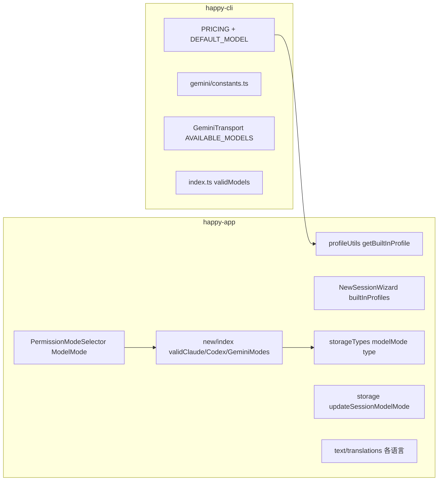

# AI 最新模型是如何追加上去的

本文说明在本仓库中追加或更新 AI 模型（Claude、Codex、Gemini 等）时需要在哪些地方修改，以及推荐的追加顺序。

## 如何引用本文档（下次更新模型时）

**可直接对 AI 或执行者说：**

> 按 `docs/adding-ai-models.md` 追加/更新最新 [Claude | Gemini | Codex] 模型：先查官方文档拿到最新模型 ID 与定价，再按文档里的表格依次改 CLI 和 App 各处，保持 ID 一致。

执行时：先查当前最新的 API 模型 ID（如 [Anthropic](https://docs.anthropic.com/en/docs/about-claude/models)、[Gemini](https://ai.google.dev/gemini-api/docs/models)），再按下文「1. Claude」「2. Codex」「3. Gemini」对应表格逐项修改即可。

---

## 结论概览

仓库**没有**统一的「模型注册表」或单一配置文件。新模型需要在下述多处**分别追加**，并保持 ID/名称一致。

---

## 1. Claude / Anthropic 系

| 位置 | 作用 | 如何追加 |
|------|------|----------|
| [packages/happy-cli/src/utils/pricing.ts](../packages/happy-cli/src/utils/pricing.ts) | 用量计费：按 modelId 查单价；未知模型用 `DEFAULT_MODEL` 或按 opus/sonnet/haiku 模糊匹配 | 在 `PRICING` 里增加新 key（如 `claude-4.5-opus`）；若希望作为默认，改 `DEFAULT_MODEL`；必要时在 `calculateCost` 的 if/else 里加一层模糊匹配 |
| [packages/happy-app/sources/sync/profileUtils.ts](../packages/happy-app/sources/sync/profileUtils.ts) | 内置 Profile：`anthropic` / `deepseek` / `zai` 等返回 `anthropicConfig.model`、`environmentVariables`（如 ANTHROPIC_MODEL） | 新 provider：在 `getBuiltInProfile` 加 case，在 `DEFAULT_PROFILES` 加一项；仅新模型：改对应 case 里的 `anthropicConfig.model` 或 env 默认值 |
| [packages/happy-app/sources/components/NewSessionWizard.tsx](../packages/happy-app/sources/components/NewSessionWizard.tsx) | 新建会话时的内置 Profile 列表及默认 model | 在 `builtInProfiles` 里改对应 profile 的 `anthropicConfig.model`（或 openaiConfig.model） |
| [packages/happy-app/sources/components/PermissionModeSelector.tsx](../packages/happy-app/sources/components/PermissionModeSelector.tsx) | `ModelMode` 类型：Claude 侧为 `'default' \| 'adaptiveUsage' \| 'sonnet' \| 'opus'` | 若新增「模式」（如新档位），在 `ModelMode` 类型中追加 |
| [packages/happy-app/sources/app/(app)/new/index.tsx](../packages/happy-app/sources/app/(app)/new/index.tsx) | 新建会话：`validClaudeModes`、默认 modelMode、校验当前 agent 是否支持该 mode | 新 Claude 模式：加入 `validClaudeModes`（约 370、723 行）；若需新默认，在 useState 与 useEffect 的 setModelMode 分支里改 |

---

## 2. Codex / OpenAI 系

| 位置 | 作用 | 如何追加 |
|------|------|----------|
| [packages/happy-app/sources/sync/profileUtils.ts](../packages/happy-app/sources/sync/profileUtils.ts) | `openai` / `azure-openai` 的 OPENAI_MODEL、OPENAI_SMALL_FAST_MODEL、CODEX_SMALL_FAST_MODEL 等 | 改对应 case 的 `environmentVariables` 中 model 相关值（如 `gpt-5-codex-high` → 新 ID） |
| [packages/happy-app/sources/components/PermissionModeSelector.tsx](../packages/happy-app/sources/components/PermissionModeSelector.tsx) | `ModelMode` 包含 `gpt-5-codex-high/medium/low`、`gpt-5-minimal`、`gpt-5-low/medium/high` | 新档位：在类型里追加新字面量 |
| [packages/happy-app/sources/app/(app)/new/index.tsx](../packages/happy-app/sources/app/(app)/new/index.tsx) | `validCodexModes`、默认 `gpt-5-codex-high` | 新 Codex 模式：加入 `validCodexModes`（约 371、724 行）；改默认则改 384、740 行 |
| [packages/happy-app/sources/components/NewSessionWizard.tsx](../packages/happy-app/sources/components/NewSessionWizard.tsx) | 新建会话 UI 中 Codex 的模型选项（当前仅 high/medium/low 三项） | 若要在向导里多一个选项：在「Model Mode」的 codex 分支数组（约 1633–1636 行）追加 `{ value, label, description, icon }` |
| [packages/happy-app/sources/text/translations/*.ts](../packages/happy-app/sources/text/translations/) 与 [_default.ts](../packages/happy-app/sources/text/_default.ts) | 展示名：如 `gpt5CodexLow`、`gpt5CodexMedium`、`gpt5CodexHigh` | 新展示名：在 `_default.ts` 与各语言文件里加对应 key（如 `gpt5CodexNew`） |

---

## 3. Gemini

| 位置 | 作用 | 如何追加 |
|------|------|----------|
| [packages/happy-cli/src/gemini/constants.ts](../packages/happy-cli/src/gemini/constants.ts) | `DEFAULT_GEMINI_MODEL = 'gemini-2.5-pro'` | 仅改默认：改该常量；新模型 ID 需与下面几处一致 |
| [packages/happy-cli/src/agent/transport/handlers/GeminiTransport.ts](../packages/happy-cli/src/agent/transport/handlers/GeminiTransport.ts) | `AVAILABLE_MODELS` 数组（用于错误提示「Available models: …」） | 在数组中追加新 model ID |
| [packages/happy-cli/src/index.ts](../packages/happy-cli/src/index.ts) | `validModels`（如 Gemini 子命令校验） | 与 `AVAILABLE_MODELS` 保持一致，追加同一 ID |
| [packages/happy-cli/src/gemini/runGemini.ts](../packages/happy-cli/src/gemini/runGemini.ts) | 默认展示 model、错误信息中的「Available models」 | 多处 `'gemini-2.5-pro'` 默认值；错误信息中的模型列表与 `AVAILABLE_MODELS` 同步 |
| [packages/happy-app/sources/components/PermissionModeSelector.tsx](../packages/happy-app/sources/components/PermissionModeSelector.tsx) | `ModelMode` 包含 `gemini-2.5-pro/flash/flash-lite` | 新 Gemini 档位：在类型中追加 |
| [packages/happy-app/sources/app/(app)/new/index.tsx](../packages/happy-app/sources/app/(app)/new/index.tsx) | `validGeminiModes`、默认 `gemini-2.5-pro` | 新档位加入 `validGeminiModes`（约 373、726 行）；改默认改 384、742 行 |
| [packages/happy-app/sources/sync/storageTypes.ts](../packages/happy-app/sources/sync/storageTypes.ts) | Session 的 `modelMode` 类型（仅 Gemini 部分） | 新 Gemini 模式：扩展 `modelMode` 的联合类型 |
| [packages/happy-app/sources/sync/storage.ts](../packages/happy-app/sources/sync/storage.ts) | `updateSessionModelMode` 的参数类型 | 与 storageTypes 一致，扩展为可选的新 model 值 |

---

## 4. 不涉及「AI 模型版本」的部分

- [packages/happy-server/sources/versions.ts](../packages/happy-server/sources/versions.ts) 与 [versionRoutes.ts](../packages/happy-server/sources/app/api/routes/versionRoutes.ts)：只做 **App 版本**（iOS/Android 是否需更新），与 AI 模型无关。

---

## 5. 追加新模型时的推荐顺序

1. **定 ID**：统一新模型的 ID（如 `claude-4.5-opus`、`gemini-2.5-new`）。
2. **CLI**：pricing（若需计费）、Gemini 的 constants + GeminiTransport + index + runGemini（若为 Gemini）。
3. **Profile**：profileUtils 与 NewSessionWizard 的 builtInProfiles，使默认/内置 profile 指向新模型（或新 provider）。
4. **App 类型与校验**：PermissionModeSelector 的 `ModelMode`、new/index.tsx 的 `valid*Modes` 与默认值、storageTypes + storage 的 modelMode 类型。
5. **UI 选项**：NewSessionWizard 或 new 页面里展示的模型选项列表（若需在选 model 的 UI 中露出）。
6. **i18n**：新展示名在 _default 与各语言文件中追加。

无自动化脚本或单一「模型注册表」；以上全部人工同步，容易漏改，建议改完做一次「新建会话 + 选不同 agent/model」的回归。
