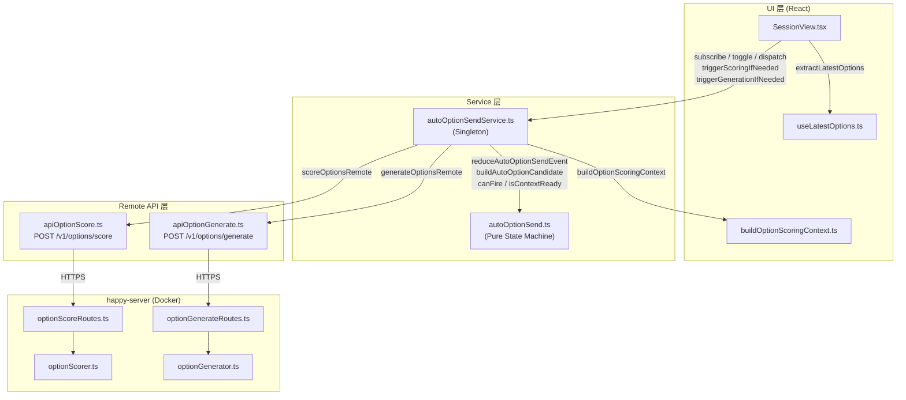
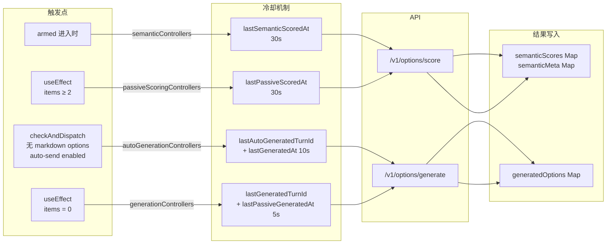
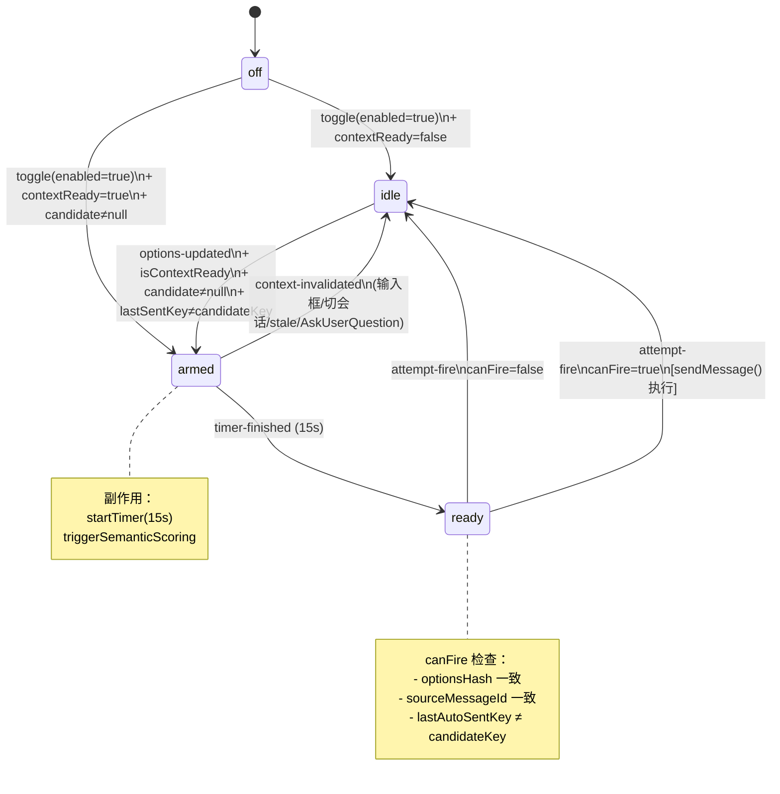
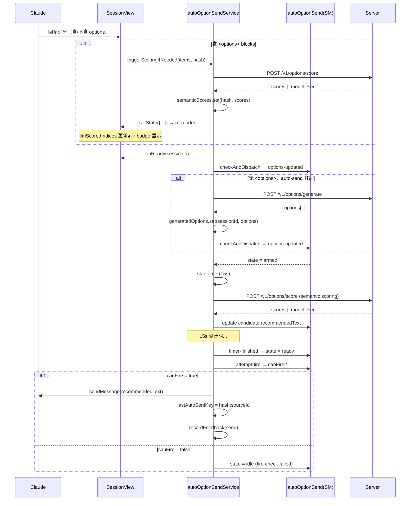
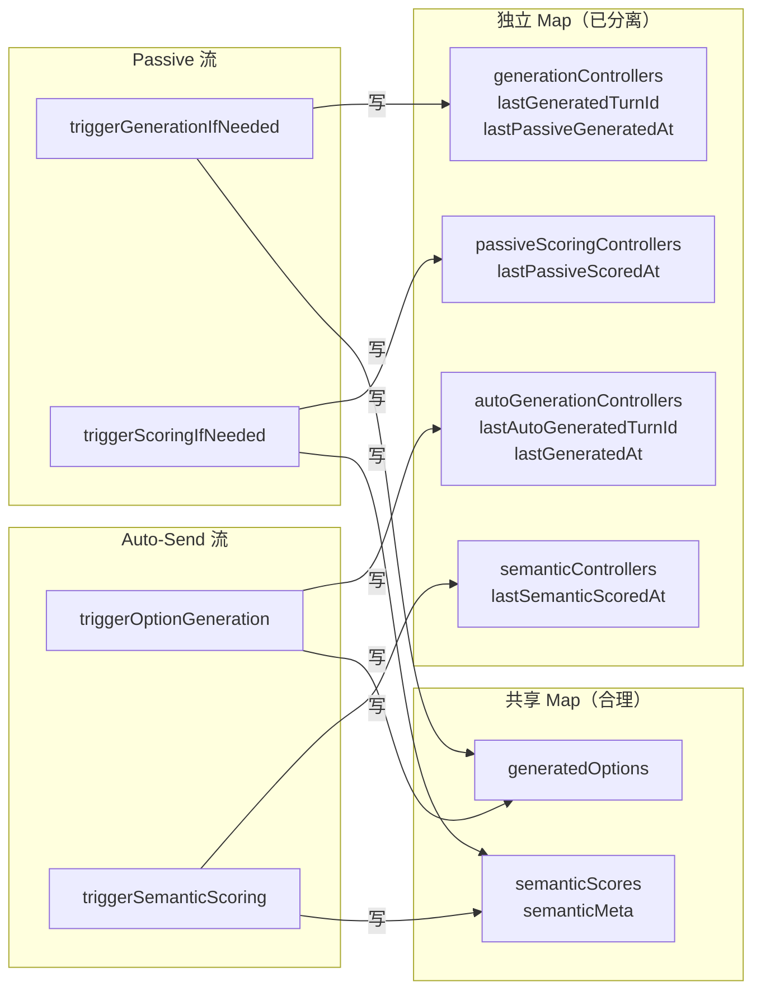

# AutoSend 模块依赖关系图

## 1. 模块依赖图

```mermaid
graph TD
    subgraph UI["UI 层 (React)"]
        SV["SessionView.tsx"]
        ULO["useLatestOptions.ts"]
        BOSC["buildOptionScoringContext.ts"]
    end

    subgraph Service["Service 层"]
        SVC["autoOptionSendService.ts\n(Singleton)"]
        SM["autoOptionSend.ts\n(Pure State Machine)"]
    end

    subgraph API["Remote API 层"]
        SCORE_API["apiOptionScore.ts\nPOST /v1/options/score"]
        GEN_API["apiOptionGenerate.ts\nPOST /v1/options/generate"]
    end

    subgraph Server["happy-server (Docker)"]
        SCORE_RT["optionScoreRoutes.ts"]
        GEN_RT["optionGenerateRoutes.ts"]
        SCORER["optionScorer.ts"]
        GENERATOR["optionGenerator.ts"]
    end

    SV -->|"subscribe / toggle / dispatch\ntriggerScoringIfNeeded\ntriggerGenerationIfNeeded"| SVC
    SV -->|"extractLatestOptions"| ULO
    SVC -->|"reduceAutoOptionSendEvent\nbuildAutoOptionCandidate\ncanFire / isContextReady"| SM
    SVC -->|"buildOptionScoringContext"| BOSC
    SVC -->|"scoreOptionsRemote"| SCORE_API
    SVC -->|"generateOptionsRemote"| GEN_API
    SCORE_API -->|"HTTPS"| SCORE_RT
    GEN_API -->|"HTTPS"| GEN_RT
    SCORE_RT --> SCORER
    GEN_RT --> GENERATOR
```

---

## 2. 4 条 LLM 调用路径

```mermaid
flowchart LR
    subgraph Triggers["触发点"]
        T1["armed 进入时"]
        T2["useEffect\nitems ≥ 2"]
        T3["checkAndDispatch\n无 markdown options\nauto-send enabled"]
        T4["useEffect\nitems = 0"]
    end

    subgraph Cooldown["冷却机制"]
        C1["lastSemanticScoredAt\n30s"]
        C2["lastPassiveScoredAt\n30s"]
        C3["lastAutoGeneratedTurnId\n+ lastGeneratedAt 10s"]
        C4["lastGeneratedTurnId\n+ lastPassiveGeneratedAt 5s"]
    end

    subgraph Endpoints["API"]
        E1["/v1/options/score"]
        E2["/v1/options/generate"]
    end

    subgraph Output["结果写入"]
        O1["semanticScores Map\nsemanticMeta Map"]
        O2["generatedOptions Map"]
    end

    T1 -->|"semanticControllers"| C1 --> E1 --> O1
    T2 -->|"passiveScoringControllers"| C2 --> E1 --> O1
    T3 -->|"autoGenerationControllers"| C3 --> E2 --> O2
    T4 -->|"generationControllers"| C4 --> E2 --> O2
```

---

## 3. 状态机事件流

```mermaid
stateDiagram-v2
    [*] --> off

    off --> idle : toggle(enabled=true)\n+ contextReady=false
    off --> armed : toggle(enabled=true)\n+ contextReady=true\n+ candidate≠null

    idle --> armed : options-updated\n+ isContextReady\n+ candidate≠null\n+ lastSentKey≠candidateKey

    armed --> idle : context-invalidated\n(输入框/切会话/stale/AskUserQuestion)
    armed --> ready : timer-finished (15s)

    ready --> idle : attempt-fire\ncanFire=false

    ready --> idle : attempt-fire\ncanFire=true\n[sendMessage() 执行]

    note right of armed
        副作用：
        startTimer(15s)
        triggerSemanticScoring
    end note

    note right of ready
        canFire 检查：
        - optionsHash 一致
        - sourceMessageId 一致
        - lastAutoSentKey ≠ candidateKey
    end note
```

---

## 4. 数据流：Claude 回复 → 自动发送

```mermaid
sequenceDiagram
    participant Claude
    participant SV as SessionView
    participant SVC as autoOptionSendService
    participant SM as autoOptionSend(SM)
    participant Server

    Claude->>SV: 回复消息（含/不含 options）

    alt 含 <options> blocks
        SV->>SVC: triggerScoringIfNeeded(items, hash)
        SVC->>Server: POST /v1/options/score
        Server-->>SVC: { scores[], modelUsed }
        SVC->>SVC: semanticScores.set(hash, scores)
        SVC->>SV: setState({...}) → re-render
        Note over SV: llmScoredIndices 更新\n✨ badge 显示
    end

    SVC->>SV: onReady(sessionId)
    SVC->>SM: checkAndDispatch → options-updated

    alt 无 <options>，auto-send 开启
        SVC->>Server: POST /v1/options/generate
        Server-->>SVC: { options[] }
        SVC->>SVC: generatedOptions.set(sessionId, options)
        SVC->>SM: checkAndDispatch → options-updated
    end

    SM-->>SVC: state = armed
    SVC->>SVC: startTimer(15s)
    SVC->>Server: POST /v1/options/score (semantic scoring)
    Server-->>SVC: { scores[], modelUsed }
    SVC->>SM: update candidate.recommendedText

    Note over SVC: 15s 倒计时...

    SVC->>SM: timer-finished → state = ready
    SVC->>SM: attempt-fire → canFire?

    alt canFire = true
        SVC->>Claude: sendMessage(recommendedText)
        SVC->>SVC: lastAutoSentKey = hash:sourceId
        SVC->>SVC: recordFeedback(send)
    else canFire = false
        SVC->>SM: state = idle (fire-check-failed)
    end
```

---

## 5. 关键 Map 隔离示意

```mermaid
graph LR
    subgraph PassiveFlow["Passive 流"]
        PG["triggerGenerationIfNeeded"]
        PS["triggerScoringIfNeeded"]
    end

    subgraph AutoSendFlow["Auto-Send 流"]
        AG["triggerOptionGeneration"]
        AS["triggerSemanticScoring"]
    end

    subgraph SharedMaps["共享 Map（合理）"]
        GO["generatedOptions"]
        SS["semanticScores\nsemanticMeta"]
    end

    subgraph IsolatedMaps["独立 Map（已分离）"]
        direction TB
        M1["generationControllers\nlastGeneratedTurnId\nlastPassiveGeneratedAt"]
        M2["autoGenerationControllers\nlastAutoGeneratedTurnId\nlastGeneratedAt"]
        M3["passiveScoringControllers\nlastPassiveScoredAt"]
        M4["semanticControllers\nlastSemanticScoredAt"]
    end

    PG -->|写| M1
    PG -->|写| GO
    PS -->|写| M3
    PS -->|写| SS

    AG -->|写| M2
    AG -->|写| GO
    AS -->|写| M4
    AS -->|写| SS
```
