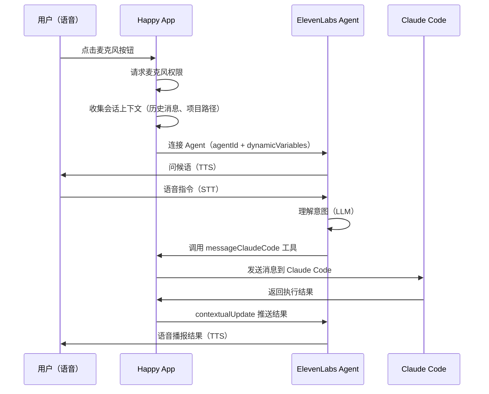

# ElevenLabs 语音功能配置指南

本文说明如何从零配置 Happy Coder 的语音功能。语音功能基于 ElevenLabs Conversational AI 平台，需要在 ElevenLabs 创建 Agent 并将 Agent ID 配置到项目中。

## 如何引用本文档

**可直接对 AI 或执行者说：**

> 按 `docs/elevenlabs-voice-setup.md` 配置语音功能：先去 ElevenLabs 创建 Agent，配好 System Prompt、Client Tools 和 Dynamic Variables，拿到 Agent ID 后配到 app.config.js 和环境变量里。

---

## 架构概览



ElevenLabs Agent 的角色是**语音中间层**，集成了：
- **STT**（语音转文字）— 用户说的话转文本
- **LLM**（理解意图）— 决定调用哪个工具
- **TTS**（文字转语音）— 把结果读给用户

---

## 前置条件

- ElevenLabs 账号（https://elevenlabs.io/sign-up）
- 费用参考：

| 计划 | 月费 | 语音额度 |
|------|------|---------|
| Free | $0 | ~10 分钟 |
| Starter | $5 | ~30 分钟 |
| Creator | $22 | ~100 分钟 |
| Pro | $99 | ~500 分钟 |

---

## 第一步：创建 Agent

1. 登录 https://elevenlabs.io
2. 左侧导航栏点击 **Conversational AI**
3. 点击 **Create Agent** → **Blank template**（空白模板）
4. 命名为 `Happy Coder Voice Assistant`

---

## 第二步：配置 System Prompt

在 Agent 设置页的 **Agent** 标签下，找到 **System Prompt**，填入：

```
You are the voice interface for Happy Coder, a tool that controls Claude Code remotely.

Your role:
- Relay user's voice commands to Claude Code via the messageClaudeCode tool
- Handle permission requests from Claude Code (allow/deny) via processPermissionRequest
- Report Claude Code's responses and status updates to the user verbally

Context:
- You will receive dynamic variables: {{sessionId}} and {{initialConversationContext}}
- You will receive contextual updates about session events, messages, and permission requests
- The initialConversationContext contains the full session history when voice starts

Rules:
- When the user gives a coding instruction, call messageClaudeCode immediately with the instruction
- When Claude Code asks for permission, clearly explain what it wants to do, then ask the user to allow or deny
- When you receive a ready event (Claude Code done working), report the summary to the user immediately
- Keep your verbal responses concise — the user wants speed, not lengthy explanations
- If the user says something ambiguous, ask for clarification before calling a tool
- Respond in the same language the user speaks to you
```

### First Message（首次问候语）

```
Hey! I'm connected to your coding session. What would you like me to tell Claude Code?
```

---

## 第三步：配置 Client Tools

在 Agent 设置页找到 **Tools** 部分，添加以下两个 **Client** 类型的工具。

> 注意：类型必须选 **Client**（不是 Server），因为这些工具由 APP 端执行。

### Tool 1: messageClaudeCode

| 字段 | 值 |
|------|-----|
| **Name** | `messageClaudeCode` |
| **Type** | Client |
| **Description** | `Send a message or instruction to Claude Code in the active coding session. Use this whenever the user wants to communicate with Claude Code.` |

参数：

| 参数名 | 类型 | 必填 | 描述 |
|--------|------|------|------|
| `message` | `string` | Yes | `The message to send to Claude Code. This should be the user's instruction or question.` |

### Tool 2: processPermissionRequest

| 字段 | 值 |
|------|-----|
| **Name** | `processPermissionRequest` |
| **Type** | Client |
| **Description** | `Process a permission request from Claude Code. Call this when the user decides to allow or deny a tool usage request from Claude Code.` |

参数：

| 参数名 | 类型 | 必填 | 描述 |
|--------|------|------|------|
| `decision` | `string` (enum: `allow`, `deny`) | Yes | `The user's decision on the permission request. Must be either 'allow' or 'deny'.` |

### 工具在 APP 中的对应代码

文件：`packages/happy-app/sources/realtime/realtimeClientTools.ts`

```typescript
// messageClaudeCode — 验证 message 参数后调用 sync.sendMessage()
// processPermissionRequest — 验证 decision 后调用 sessionAllow() 或 sessionDeny()
```

---

## 第四步：配置 Dynamic Variables

在 System Prompt 中使用 `{{variable}}` 语法即可自动声明变量。APP 启动语音时会传入实际值。

| 变量名 | 来源 | 用途 |
|--------|------|------|
| `sessionId` | APP 自动传入 | 当前 Claude Code 会话 ID |
| `initialConversationContext` | `voiceHooks.onVoiceStarted()` 返回值 | 包含会话历史、项目路径、Session 摘要的完整上下文 |

### initialConversationContext 示例

```
THIS IS AN ACTIVE SESSION:

# Session ID: 7f3a8b21-c9e1-4d5f-a2b1-3c4d5e6f7g8h
# Project path: ~/my-project
# Session summary:
Implementing user authentication with JWT tokens

## Our interaction history so far

History of messages in session: 7f3a8b21-...

Claude Code:
<text>I'll help you implement JWT authentication.</text>

User sent message:
<text>Please focus on the auth module</text>
```

---

## 第五步：配置语音

在 **Voice** 标签下：

1. 选择一个自然、清晰的声音
2. **Model** 建议选 **Turbo v2.5** 或更高版本（低延迟）
3. **Language** 设为 **Multilingual**（APP 在运行时通过 override 传入用户选择的具体语言）

### 支持的语言

APP 中支持的 ElevenLabs 语言列表见 `packages/happy-app/sources/constants/Languages.ts`，包括：
en, es, fr, de, it, pt, pt-br, ru, zh, ja, ko, ar, hi, nl, sv, no, da, fi, pl, tr, vi, id, ms, uk, cs, hu, ro, bg, el, hr, sk 等 30+ 种。

用户在 APP 设置中选择语言后，通过 `overrides.agent.language` 传递给 Agent。

---

## 第六步：获取 Agent ID

创建完成后，在以下位置找到 Agent ID：
- Agent 页面的 **URL** 中（格式：`agent_xxxxxxxxxxxx`）
- Agent 的 **Settings** 或 **Overview** 页面

---

## 第七步：配置到项目

### 7.1 修改 app.config.js

文件：`packages/happy-app/app.config.js`

当前 `extra.app` 中**缺少** ElevenLabs 配置，需要添加：

```javascript
// 修改前（第 179-184 行）
extra: {
  // ...
  app: {
    postHogKey: process.env.EXPO_PUBLIC_POSTHOG_API_KEY,
    revenueCatAppleKey: process.env.EXPO_PUBLIC_REVENUE_CAT_APPLE,
    revenueCatGoogleKey: process.env.EXPO_PUBLIC_REVENUE_CAT_GOOGLE,
    revenueCatStripeKey: process.env.EXPO_PUBLIC_REVENUE_CAT_STRIPE,
  },
},

// 修改后
extra: {
  // ...
  app: {
    postHogKey: process.env.EXPO_PUBLIC_POSTHOG_API_KEY,
    revenueCatAppleKey: process.env.EXPO_PUBLIC_REVENUE_CAT_APPLE,
    revenueCatGoogleKey: process.env.EXPO_PUBLIC_REVENUE_CAT_GOOGLE,
    revenueCatStripeKey: process.env.EXPO_PUBLIC_REVENUE_CAT_STRIPE,
    elevenLabsAgentIdDev: process.env.EXPO_PUBLIC_ELEVENLABS_AGENT_ID_DEV,
    elevenLabsAgentIdProd: process.env.EXPO_PUBLIC_ELEVENLABS_AGENT_ID_PROD,
  },
},
```

### 7.2 设置环境变量

**方式一：.env 文件（本地开发）**

在 `packages/happy-app/` 下创建 `.env`：

```bash
EXPO_PUBLIC_ELEVENLABS_AGENT_ID_DEV=agent_xxxxxxxxxxxx
EXPO_PUBLIC_ELEVENLABS_AGENT_ID_PROD=agent_xxxxxxxxxxxx
```

> 开发阶段 DEV 和 PROD 可以用同一个 Agent ID。

**方式二：EAS Secrets（生产构建）**

```bash
eas secret:create --name EXPO_PUBLIC_ELEVENLABS_AGENT_ID_PROD --value agent_xxxxxxxxxxxx
eas secret:create --name EXPO_PUBLIC_ELEVENLABS_AGENT_ID_DEV --value agent_xxxxxxxxxxxx
```

**方式三：Shell 环境变量（临时测试）**

```bash
EXPO_PUBLIC_ELEVENLABS_AGENT_ID_DEV=agent_xxxxxxxxxxxx yarn workspace happy-app start
```

### 配置加载优先级

`appConfig.ts` 的加载顺序（后面覆盖前面）：

1. `ExponentConstants.manifest` → `extra.app`（Native prebuild 时写入）
2. `Constants.expoConfig` → `extra.app`（Expo config 读取）
3. `process.env.EXPO_PUBLIC_*` 运行时环境变量覆盖

---

## 验证

配置完成后：

1. 启动 APP：`yarn workspace happy-app start`
2. 打开一个 Claude Code 会话
3. 点击输入框右侧的语音按钮（麦克风图标）
4. 首次使用会请求麦克风权限 → 允许
5. 应该能听到 Agent 的问候语，然后可以用语音操控 Claude Code

---

## 排查问题

### 控制台日志关键词

| 日志消息 | 含义 | 解决方案 |
|---------|------|---------|
| `Agent ID not configured` | 环境变量未生效 | 检查 .env 和 app.config.js 配置 |
| `No voice session registered` | RealtimeVoiceSession 组件未挂载 | 检查组件树是否包含 RealtimeVoiceSession |
| `Realtime voice not available` | ElevenLabs SDK 初始化失败 | 检查 Agent ID 是否有效 |
| `Voice token request failed` | 实验功能开启但后端 token 端点不可用 | 关闭实验功能或部署 voice token 端点 |
| `Failed to start realtime session` | 启动失败 | 检查网络连接和 Agent ID |

### 已知问题

- `RealtimeSession.ts:32-35` 在 Agent ID 缺失时**静默返回**，只打 `console.error`，用户看不到任何提示。建议后续修复为弹窗提示。
- iOS/Android 首次使用语音时必须先获得麦克风权限，否则会失败。

---

## 相关代码文件索引

| 功能 | 文件路径 |
|------|---------|
| 语音按钮 UI | `packages/happy-app/sources/components/AgentInput.tsx` |
| 会话管理（启动/停止） | `packages/happy-app/sources/realtime/RealtimeSession.ts` |
| ElevenLabs 集成（Native） | `packages/happy-app/sources/realtime/RealtimeVoiceSession.tsx` |
| ElevenLabs 集成（Web） | `packages/happy-app/sources/realtime/RealtimeVoiceSession.web.tsx` |
| Client Tools 定义 | `packages/happy-app/sources/realtime/realtimeClientTools.ts` |
| Voice Hooks（上下文更新） | `packages/happy-app/sources/realtime/hooks/voiceHooks.ts` |
| 上下文格式化 | `packages/happy-app/sources/realtime/hooks/contextFormatters.ts` |
| 全局开关配置 | `packages/happy-app/sources/realtime/voiceConfig.ts` |
| 麦克风权限 | `packages/happy-app/sources/utils/microphonePermissions.ts` |
| Voice Token API | `packages/happy-app/sources/sync/apiVoice.ts` |
| 语言映射 | `packages/happy-app/sources/constants/Languages.ts` |
| APP 配置加载 | `packages/happy-app/sources/sync/appConfig.ts` |
| Expo 构建配置 | `packages/happy-app/app.config.js` |

---

## APP 推送给 Agent 的实时事件

配置完成后，APP 会通过 `sendContextualUpdate` 和 `sendTextMessage` 持续向 Agent 推送以下事件：

| 事件 | 格式 | 开关（voiceConfig.ts） |
|------|------|----------------------|
| 新消息（Claude 回复） | `Claude Code: \n<text>...</text>` | `DISABLE_MESSAGES` |
| 新消息（用户文字） | `User sent message: \n<text>...</text>` | `DISABLE_MESSAGES` |
| 工具调用 | `Claude Code is using {toolName} - {description}` | `DISABLE_TOOL_CALLS` / `LIMITED_TOOL_CALLS` |
| 权限请求 | 包含 request_id, tool_name, tool_args 的结构化文本 | `DISABLE_PERMISSION_REQUESTS` |
| Session 上下线 | `Session came online/went offline: {id}` | `DISABLE_SESSION_STATUS` |
| Session 聚焦 | `Session became focused: {id}` | `DISABLE_SESSION_FOCUS` |
| Claude 完成工作 | `Claude Code done working in session: {id}...` | `DISABLE_READY_EVENTS` |
