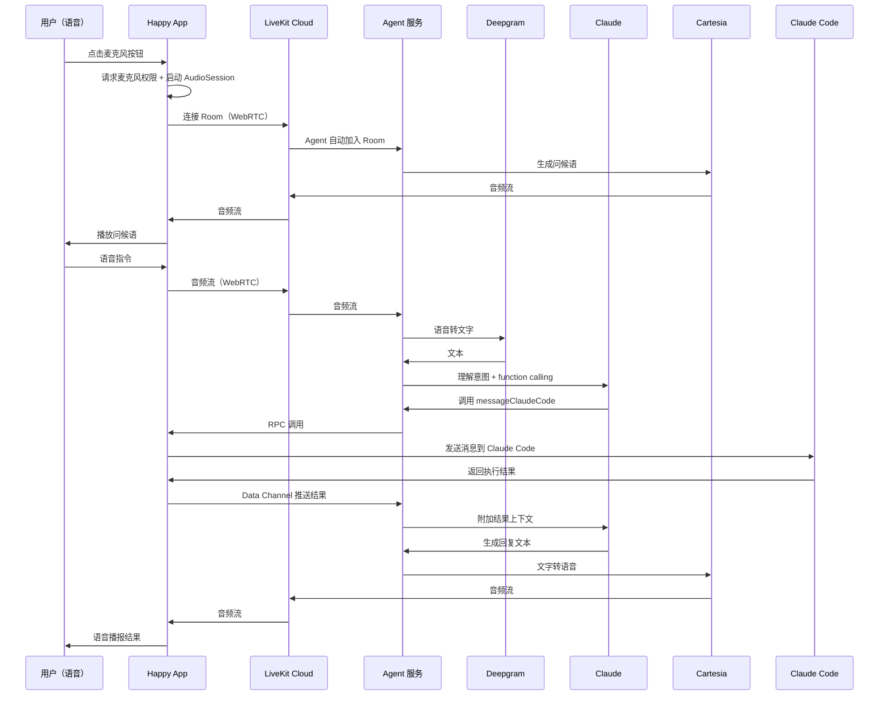

# LiveKit Cloud 语音功能配置指南

本文说明如何配置 Happy Coder 的 LiveKit 语音后端。使用 LiveKit Cloud（免费 1000 min/月）+ Agent 服务，实现与 ElevenLabs 完全对等的语音功能。两种后端共存，用户在 APP 设置中切换。

## 如何引用本文档

**可直接对 AI 或执行者说：**

> 按 `docs/livekit-voice-setup.md` 配置 LiveKit 语音：注册 LiveKit Cloud 拿到 API Key，启动 Agent 服务，在 APP 设置页配好凭据即可使用。

---

## 功能对照清单

逐项对照 `docs/elevenlabs-voice-setup.md`，确认所有 ElevenLabs 功能在 LiveKit 方案中均有对应实现。

| ElevenLabs 功能 | LiveKit 对应 | 状态 |
|----------------|-------------|------|
| STT（语音转文字） | Deepgram Nova-3（LiveKit 插件） | 对等 |
| LLM（理解意图） | Claude Sonnet（LiveKit Agent 调用） | 对等 |
| TTS（文字转语音） | Cartesia Sonic-3（LiveKit 插件） | 对等 |
| 实时双向音频流 | LiveKit WebRTC Room | 对等（延迟更低） |
| Client Tool: `messageClaudeCode` | LiveKit RPC `performRpc` → App `registerRpcMethod` | 对等 |
| Client Tool: `processPermissionRequest` | LiveKit RPC（同上） | 对等 |
| Dynamic Variables（`sessionId` + context） | Room metadata | 对等 |
| `sendContextualUpdate`（上下文推送） | Data Channel `publishData` type=context_update | 对等 |
| `sendUserMessage`（触发 Agent 回复） | Data Channel `publishData` type=user_message | 对等 |
| `onModeChange`（speaking/idle） | Agent 通过 Data Channel 广播状态 | 对等 |
| `onConnect` / `onDisconnect` | `RoomEvent.Connected` / `RoomEvent.Disconnected` | 对等 |
| `onError` | `RoomEvent` 错误事件 | 对等 |
| 多语言 STT/TTS（30+ 语言） | Deepgram: 36 语言，Cartesia: 多语言 | 对等 |
| 语言切换 `overrides.agent.language` | Room metadata 传递语言偏好 | 对等 |
| Token 认证 | 自签 JWT（`livekit-server-sdk`），不依赖第三方 | 对等 |
| BYOK（用户自带 API Key） | 用户填 LiveKit Cloud API Key + Secret | 对等 |
| 使用量统计 | Server 统计 Room duration | 基本对等（MVP 仅连接状态） |
| 设置页 API Key 配置 | `voice.tsx` 新增 LiveKit 配置区域 | 对等 |
| 设置页状态展示（plan/额度/进度条） | 连接状态 + Agent 在线检查 | MVP 简化版 |
| System Prompt（Agent 角色定义） | Agent 服务 `instructions` 参数 | 对等 |
| First Message（问候语） | `session.generate_reply(instructions=...)` | 对等 |
| Voice 配置（声音选择/模型） | Agent 服务 TTS 插件配置 | 对等 |

---

## 架构概览



### 与 ElevenLabs 架构对比

- **ElevenLabs**：App → ElevenLabs Cloud（STT+LLM+TTS 全包）→ App
- **LiveKit**：App → LiveKit Cloud（音频传输）→ Agent 服务（STT+LLM+TTS 编排）→ App

---

## 前置条件

- **LiveKit Cloud 账号**（https://cloud.livekit.io/）— Build 计划免费 1000 min/月
- Python 3.12+（Agent 服务运行环境）

只需要 LiveKit Cloud 一个账号。STT（Deepgram）、TTS（Cartesia）、LLM 的调用由 LiveKit Cloud Agents 框架代理，费用包含在 LiveKit Cloud 用量中，无需单独注册。

| 计划 | 月费 | 语音额度 |
|------|------|---------|
| Build（免费） | $0 | 1000 min |
| Growth | 按用量 | 无上限 |

---

## 第一步：注册 LiveKit Cloud

1. 注册 https://cloud.livekit.io/
2. 创建项目
3. 获取三个值：
   - **URL**：`wss://your-project.livekit.cloud`
   - **API Key**：`APIxxxxxxxx`
   - **API Secret**：`xxxxxxxxxxxxxxxxxxxxxxxx`

---

## 第二步：创建 Agent 服务

Agent 服务加入 LiveKit Room，接收用户音频，编排 STT→LLM→TTS，并通过 RPC 调用 App 端工具。

### 2.1 初始化项目

```bash
mkdir happy-voice-agent && cd happy-voice-agent
python -m venv .venv && source .venv/bin/activate

pip install \
  "livekit-agents[codecs]>=1.0" \
  "livekit-plugins-deepgram>=1.0" \
  "livekit-plugins-cartesia>=1.0" \
  "livekit-plugins-silero>=1.0" \
  "livekit-plugins-turn-detector>=1.0" \
  python-dotenv
```

### 2.2 环境变量

创建 `.env.local`（只需 LiveKit Cloud 凭据）：

```bash
LIVEKIT_URL=wss://your-project.livekit.cloud
LIVEKIT_API_KEY=your_api_key
LIVEKIT_API_SECRET=your_api_secret
```

### 2.3 Agent 代码

创建 `agent.py`：

```python
import json
from dotenv import load_dotenv

from livekit import agents
from livekit.agents import (
    AgentServer,
    AgentSession,
    Agent,
    RunContext,
    function_tool,
    get_job_context,
    TurnHandlingOptions,
)
from livekit.plugins import silero
from livekit.plugins.turn_detector.multilingual import MultilingualModel

load_dotenv(".env.local")


class HappyVoiceAssistant(Agent):
    def __init__(self) -> None:
        super().__init__(
            instructions="""You are the voice interface for Happy Coder, a tool that controls Claude Code remotely.

Your role:
- Relay user's voice commands to Claude Code via the messageClaudeCode tool
- Handle permission requests from Claude Code (allow/deny) via processPermissionRequest
- Report Claude Code's responses and status updates to the user verbally

Rules:
- When the user gives a coding instruction, call messageClaudeCode immediately
- When Claude Code asks for permission, clearly explain what it wants to do, then ask the user to allow or deny
- Keep your verbal responses concise
- If the user says something ambiguous, ask for clarification before calling a tool
- Respond in the same language the user speaks to you""",
            tools=[message_claude_code, process_permission_request],
        )


@function_tool()
async def message_claude_code(context: RunContext, message: str) -> str:
    """Send a message or instruction to Claude Code in the active coding session.

    Args:
        message: The message to send to Claude Code.
    """
    room = get_job_context().room
    participant = next(iter(room.remote_participants.values()))

    response = await room.local_participant.perform_rpc(
        destination_identity=participant.identity,
        method="messageClaudeCode",
        payload=json.dumps({"message": message}),
        response_timeout=10.0,
    )
    return response


@function_tool()
async def process_permission_request(context: RunContext, decision: str) -> str:
    """Process a permission request from Claude Code.

    Args:
        decision: The user's decision. Must be either 'allow' or 'deny'.
    """
    if decision not in ("allow", "deny"):
        return "Invalid decision. Must be 'allow' or 'deny'."

    room = get_job_context().room
    participant = next(iter(room.remote_participants.values()))

    response = await room.local_participant.perform_rpc(
        destination_identity=participant.identity,
        method="processPermissionRequest",
        payload=json.dumps({"decision": decision}),
        response_timeout=10.0,
    )
    return response


server = AgentServer()


@server.rtc_session(agent_name="happy-voice")
async def happy_voice_agent(ctx: agents.JobContext):
    session = AgentSession(
        stt="deepgram/nova-3:multi",
        llm="anthropic/claude-sonnet-4-6",
        tts="cartesia/sonic-3:9626c31c-bec5-4cca-baa8-f8ba9e84c8bc",
        vad=silero.VAD.load(),
        turn_handling=TurnHandlingOptions(
            turn_detection=MultilingualModel(),
        ),
    )

    await session.start(room=ctx.room, agent=HappyVoiceAssistant())

    # 从 Room metadata 读取初始上下文
    metadata = ctx.room.metadata or ""
    greeting = (
        "I'm connected to your coding session. What would you like me to tell Claude Code?"
        if metadata else
        "Hey! I'm connected. What would you like me to tell Claude Code?"
    )

    await session.generate_reply(instructions=greeting)


if __name__ == "__main__":
    agents.cli.run_app(server)
```

### 2.4 启动

```bash
python agent.py dev    # 开发（自动重载）
python agent.py start  # 生产
```

---

## 第三步：App 端集成

### 3.1 安装依赖

```bash
cd packages/happy-app
yarn add @livekit/react-native @livekit/react-native-webrtc livekit-client
yarn add @livekit/react-native-expo-plugin
npx expo install expo-build-properties
```

在 `app.config.js` 的 `plugins` 中添加：

```javascript
plugins: [
  // ... 现有插件
  ['@livekit/react-native-expo-plugin'],
  ['expo-build-properties', { android: { minSdkVersion: 24 } }],
],
```

### 3.2 环境变量

```bash
# packages/happy-app/.env
EXPO_PUBLIC_LIVEKIT_URL=wss://your-project.livekit.cloud
```

```javascript
// app.config.js extra.app 新增
livekitUrl: process.env.EXPO_PUBLIC_LIVEKIT_URL,
```

### 3.3 Server 端 Token 签发

```bash
cd packages/happy-server
yarn add livekit-server-sdk
```

```typescript
// voiceRoutes.ts 新增
import { AccessToken } from 'livekit-server-sdk';

// POST /v1/voice/livekit-token
async function livekitToken(request, reply) {
    const { sessionId } = request.body;
    const userId = request.user.id;

    // BYOK: 优先用户自带 Key
    const apiKey = request.body.userApiKey || process.env.LIVEKIT_API_KEY;
    const apiSecret = request.body.userApiSecret || process.env.LIVEKIT_API_SECRET;
    const livekitUrl = request.body.userLivekitUrl || process.env.LIVEKIT_URL;

    const roomName = `happy-voice-${sessionId}`;

    const at = new AccessToken(apiKey, apiSecret, {
        identity: userId,
        name: request.user.displayName,
    });

    at.addGrant({
        room: roomName,
        roomJoin: true,
        canPublish: true,
        canSubscribe: true,
        agent: "happy-voice",  // 触发 Agent 自动 dispatch
    });

    const token = await at.toJwt();

    reply.send({ token, url: livekitUrl, roomName });
}
```

### 3.4 实现 LiveKit VoiceSession

创建 `RealtimeVoiceSession.livekit.tsx`，实现与 ElevenLabs 相同的 `VoiceSession` 接口：

```typescript
import { AudioSession } from '@livekit/react-native';
import { Room, RoomEvent, RpcInvocationData } from 'livekit-client';
import type { VoiceSession, VoiceSessionConfig } from './types';

let roomRef: Room | null = null;

class LiveKitVoiceSessionImpl implements VoiceSession {
    async startSession(config: VoiceSessionConfig): Promise<void> {
        const { token, url } = await fetchLiveKitToken(config.sessionId);
        await AudioSession.startAudioSession();

        const room = new Room();
        roomRef = room;

        // 注册 RPC 方法（对应 ElevenLabs Client Tools）
        room.localParticipant.registerRpcMethod(
            'messageClaudeCode',
            async (data: RpcInvocationData) => {
                const { message } = JSON.parse(data.payload);
                await sync.sendMessage(config.sessionId, message);
                return JSON.stringify({ status: 'sent' });
            }
        );

        room.localParticipant.registerRpcMethod(
            'processPermissionRequest',
            async (data: RpcInvocationData) => {
                const { decision } = JSON.parse(data.payload);
                // 取第一个 pending request（同 ElevenLabs 实现）
                const requests = storage.getState().agentStates[config.sessionId]?.requests || {};
                const requestId = Object.keys(requests)[0];
                if (!requestId) return JSON.stringify({ status: 'no_pending_request' });

                decision === 'allow'
                    ? await sessionAllow(config.sessionId, requestId)
                    : await sessionDeny(config.sessionId, requestId);
                return JSON.stringify({ status: 'done' });
            }
        );

        // 写入初始上下文（对应 ElevenLabs dynamicVariables）
        room.localParticipant.setMetadata(JSON.stringify({
            sessionId: config.sessionId,
            language: getElevenLabsCodeFromPreference(settings.voiceAssistantLanguage),
            initialContext: config.initialContext || '',
        }));

        // 监听事件（对应 ElevenLabs onConnect/onDisconnect/onError/onModeChange）
        room.on(RoomEvent.Connected, () => {
            storage.getState().setRealtimeStatus('connected');
            storage.getState().setRealtimeMode('idle');
        });
        room.on(RoomEvent.Disconnected, () => {
            storage.getState().setRealtimeStatus('disconnected');
            storage.getState().setRealtimeMode('idle', true);
            storage.getState().clearRealtimeModeDebounce();
        });

        storage.getState().setRealtimeStatus('connecting');
        await room.connect(url, token);
    }

    async endSession(): Promise<void> {
        if (roomRef) { await roomRef.disconnect(); roomRef = null; }
        await AudioSession.stopAudioSession();
        storage.getState().setRealtimeStatus('disconnected');
    }

    // 对应 ElevenLabs sendUserMessage — 触发 Agent 主动回复
    sendTextMessage(message: string): void {
        if (!roomRef) return;
        roomRef.localParticipant.publishData(
            new TextEncoder().encode(JSON.stringify({ type: 'user_message', message })),
            { reliable: true }
        );
    }

    // 对应 ElevenLabs sendContextualUpdate — 仅注入上下文不触发回复
    sendContextualUpdate(update: string): void {
        if (!roomRef) return;
        roomRef.localParticipant.publishData(
            new TextEncoder().encode(JSON.stringify({ type: 'context_update', content: update })),
            { reliable: true }
        );
    }
}
```

### 3.5 后端选择逻辑

在 `RealtimeSession.ts` 中根据用户设置选择后端：

```typescript
const voiceBackend = storage.getState().settings.voiceBackend; // 'elevenlabs' | 'livekit'

if (voiceBackend === 'livekit') {
    // LiveKit 流程
} else {
    // 现有 ElevenLabs 流程（完全不变）
}
```

---

## 第四步：App 设置页

与 ElevenLabs 设置模式对齐，在 `voice.tsx` 中增加语音后端选择和 LiveKit 配置。

### 4.1 Settings Store 新增字段

```typescript
// settings.ts
voiceBackend: z.enum(['elevenlabs', 'livekit']).describe("Voice backend"),
livekitApiKey: z.string().nullable().describe("LiveKit Cloud API Key (BYOK)"),
livekitApiSecret: z.string().nullable().describe("LiveKit Cloud API Secret (BYOK)"),

// 默认值
voiceBackend: 'elevenlabs',  // 保持现有用户不受影响
livekitApiKey: null,
livekitApiSecret: null,
```

### 4.2 voiceConfig.ts 新增类型

```typescript
export type VoiceBackend = 'elevenlabs' | 'livekit';

export const VOICE_BACKEND_LIST: readonly { id: VoiceBackend; label: string; description: string }[] = [
    {
        id: 'livekit',
        label: 'LiveKit',
        description: 'Open-source voice AI — 1000 free min/month',
    },
    {
        id: 'elevenlabs',
        label: 'ElevenLabs',
        description: 'Premium conversational AI — requires ElevenLabs account',
    },
] as const;
```

### 4.3 设置页 UI

```
┌─────────────────────────────────────────────┐
│ Realtime Voice Backend                       │
│ ○ LiveKit                                    │
│   Open-source voice AI — 1000 free min/month │
│ ● ElevenLabs                                 │
│   Premium conversational AI                  │
├─────────────────────────────────────────────┤
│ LiveKit Cloud (当选择 LiveKit 时显示)          │
│                                              │
│  API Key     [____________________________]  │
│  API Secret  [____________________________]  │
│                                              │
│  [Save & Verify]              [Clear]        │
│                                              │
│  ✅ Connected — Agent ready                  │
│                                              │
│  用量统计由 Server 自行记录：                   │
│  Usage: 127 / 1000 min (12%)                 │
│  ████░░░░░░░░░░░░░░░░░░░░░░░░░░  12%       │
└─────────────────────────────────────────────┘
```

#### 验证流程（对应 ElevenLabs `verifyAndSetupAgent`）

1. App 调 `POST /v1/voice/livekit-verify`，传 `apiKey` + `apiSecret`
2. Server 尝试签发测试 token + 调 `RoomServiceClient.listRooms()` 验证凭据
3. 成功：绿色勾 + "Connected — Agent ready"
4. 失败：红色错误信息

```typescript
// POST /v1/voice/livekit-verify
async function livekitVerify(request, reply) {
    const { apiKey, apiSecret } = request.body;
    try {
        const at = new AccessToken(apiKey, apiSecret, { identity: 'verify-test' });
        at.addGrant({ room: 'verify-test', roomJoin: true });
        await at.toJwt();
        reply.send({ valid: true });
    } catch (error) {
        reply.send({ valid: false, error: error.message });
    }
}
```

#### 状态信息（对应 ElevenLabs 订阅信息面板）

| ElevenLabs 展示 | LiveKit 对应 | 实现方式 |
|----------------|-------------|---------|
| Plan 类型 | "Build (Free)" | LiveKit Cloud 计划固定显示 |
| 字符数 用量/额度 | 分钟数 用量/额度 | Server 统计 Room duration |
| 进度条 | 进度条 | 同 |
| 重置时间 | 月初重置 | 计算距月末天数 |

> MVP 阶段可只展示连接状态和 Agent 在线状态，用量统计后续迭代。

### 4.4 BYOK（对应 ElevenLabs `userApiKey`）

与 ElevenLabs 模式一致：

| 模式 | 说明 |
|------|------|
| **服务器凭据**（默认） | 用户无需配置，Happy Server 使用自己的 LiveKit Key |
| **BYOK** | 用户填自己的 LiveKit Cloud API Key + Secret，用量计入用户账户 |

---

## 第五步：上下文推送

映射 ElevenLabs 的上下文机制到 LiveKit Data Channel，复用现有 `voiceHooks.ts` 和 `contextFormatters.ts`：

| ElevenLabs | LiveKit | App 端 API |
|------------|---------|-----------|
| `dynamicVariables` | Room metadata | `room.localParticipant.setMetadata(...)` |
| `sendContextualUpdate()` | Data Channel type=context_update | `publishData(...)` |
| `sendUserMessage()` | Data Channel type=user_message | `publishData(...)` |
| `clientTools` | RPC | `registerRpcMethod(...)` |

### Agent 端接收上下文

```python
@ctx.room.on("data_received")
def on_data(data: bytes, participant, kind):
    payload = json.loads(data.decode())

    if payload["type"] == "context_update":
        session.chat_ctx.add_message(role="system", content=payload["content"])
    elif payload["type"] == "user_message":
        session.generate_reply(instructions=payload["message"])
```

### 实时事件推送（对应 ElevenLabs voiceHooks）

| 事件 | Data Channel payload | 开关 |
|------|---------------------|------|
| Claude 新回复 | `{ type: "context_update", content: "Claude Code: ..." }` | `DISABLE_MESSAGES` |
| 用户文字消息 | `{ type: "context_update", content: "User sent: ..." }` | `DISABLE_MESSAGES` |
| 工具调用 | `{ type: "context_update", content: "Using ..." }` | `DISABLE_TOOL_CALLS` |
| 权限请求 | `{ type: "user_message", message: "Permission: ..." }` | `DISABLE_PERMISSION_REQUESTS` |
| Claude 完成工作 | `{ type: "user_message", message: "Done..." }` | `DISABLE_READY_EVENTS` |

---

## 第六步：部署 Agent 服务

Agent 服务通过 WebSocket 连接 LiveKit Cloud，部署在任何能访问互联网的机器上即可。

### Docker

```dockerfile
FROM python:3.12-slim
WORKDIR /app
COPY requirements.txt .
RUN pip install --no-cache-dir -r requirements.txt
COPY agent.py .
CMD ["python", "agent.py", "start"]
```

### 加入 docker-compose.yml

```yaml
services:
  voice-agent:
    build: { context: ./voice-agent }
    env_file: ./voice-agent/.env.local
    restart: unless-stopped
    depends_on: [server]
```

### 直接运行

```bash
LIVEKIT_URL=wss://your-project.livekit.cloud \
LIVEKIT_API_KEY=xxx \
LIVEKIT_API_SECRET=xxx \
python agent.py start
```

---

## 验证

1. 启动 Agent：`python agent.py dev` → 看到 `Agent registered: happy-voice`
2. 启动 APP：`yarn workspace happy-app start`
3. 设置 → 语音 → 选择 LiveKit 后端 → 配置 API Key（或使用服务器默认凭据）
4. 打开 Claude Code 会话 → 点击语音按钮
5. 听到问候语 → 说 "帮我创建一个 hello world 文件"
6. Agent 调用 `messageClaudeCode` RPC → App 发消息 → Claude Code 执行 → 语音播报结果

---

## 排查问题

| 日志 | 含义 | 解决 |
|------|------|------|
| `LiveKit URL not configured` | 环境变量缺失 | 检查 .env 和 app.config.js |
| `Room connection failed` | 无法连接 LiveKit Cloud | 检查 URL 和网络 |
| `Agent not dispatched` | Agent 未运行或名称不匹配 | 确认 Agent 启动且 agentName=happy-voice |
| `RPC timeout` | App 端 RPC 方法未注册 | 检查 `registerRpcMethod` |
| `AudioSession start failed` | 麦克风权限 | 检查 iOS/Android 权限设置 |
| `STT/TTS plugin error` | 供应商 API 异常 | 检查 Deepgram/Cartesia API Key |

---

## 相关代码文件索引

| 功能 | 文件路径 | 状态 |
|------|---------|------|
| 语音后端选择 | `packages/happy-app/sources/realtime/RealtimeSession.ts` | 需修改 |
| LiveKit VoiceSession | `packages/happy-app/sources/realtime/RealtimeVoiceSession.livekit.tsx` | 待创建 |
| LiveKit VoiceSession Web | `packages/happy-app/sources/realtime/RealtimeVoiceSession.livekit.web.tsx` | 待创建 |
| ElevenLabs VoiceSession | `packages/happy-app/sources/realtime/RealtimeVoiceSession.tsx` | 不变 |
| Voice Hooks | `packages/happy-app/sources/realtime/hooks/voiceHooks.ts` | 需修改（双后端适配） |
| 上下文格式化 | `packages/happy-app/sources/realtime/hooks/contextFormatters.ts` | 不变（复用） |
| 后端配置 | `packages/happy-app/sources/realtime/voiceConfig.ts` | 需修改（VoiceBackend 类型） |
| 设置页 | `packages/happy-app/sources/app/(app)/settings/voice.tsx` | 需修改（后端选择 + LiveKit 配置区） |
| Settings Store | `packages/happy-app/sources/sync/settings.ts` | 需修改（新字段） |
| Token API | `packages/happy-app/sources/sync/apiVoice.ts` | 需修改（LiveKit token/verify） |
| Server 端点 | `packages/happy-server/sources/app/api/routes/voiceRoutes.ts` | 需修改（livekit-token + livekit-verify） |
| Wire Schemas | `packages/happy-wire/src/voice.ts` | 需修改（LiveKit response schema） |
| App 配置 | `packages/happy-app/app.config.js` | 需修改（LiveKit 插件 + URL） |
| Agent 服务 | `voice-agent/agent.py` | 待创建 |
| Agent Dockerfile | `voice-agent/Dockerfile` | 待创建 |
