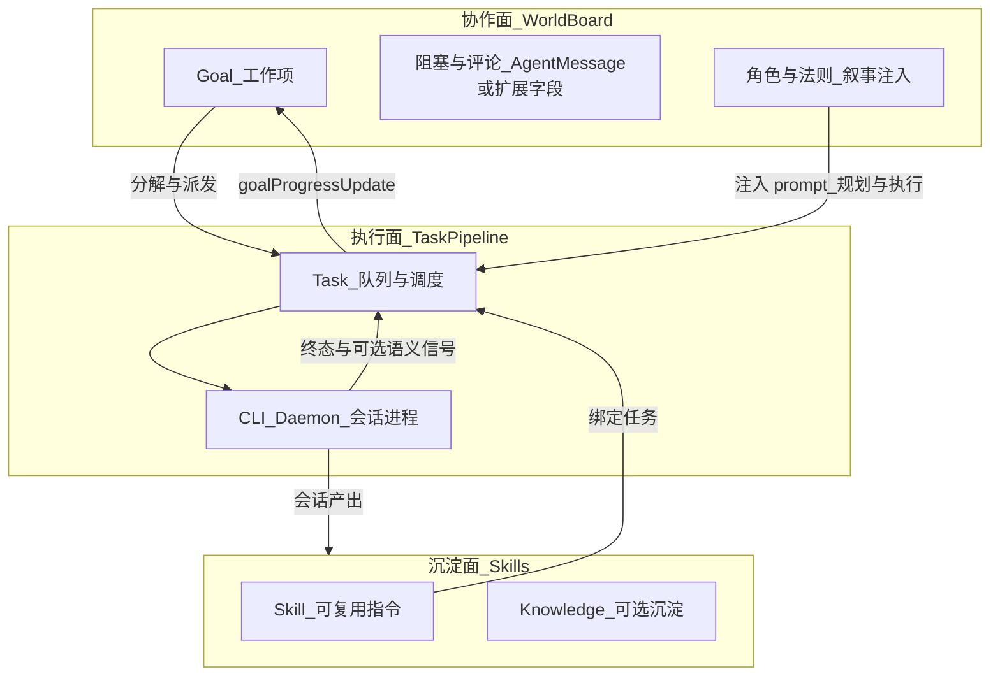

# 世界模型活化方案（跟进记录）

> **目的**：在**不接 Multica、不做外部联动**的前提下，参考其产品形态，把 Happy 已有 Goal / Task / Skill / 角色与世界叙事串成闭环；本文档用于后续「完全活化」迭代的**唯一跟进锚点**。  
> **创建**：2026-04-08  
> **状态**：跟进中  

**相关文档**：

- [World Model 实施路线图](./world-model-roadmap.md)（历史阶段与已完成项）
- [World Model 与 Multica 对照分析](./world-model-multica-analysis.md)
- [World Model 愿景 / 能力图](./world-model-vision.md)、[capability map](./world-model-capability-map.md)

---

## 跟进清单（勾选即更新）

在 PR 或迭代结束时，将对应项改为 `[x]` 并可在下方「变更记录」记一行。

- [x] **阶段 A — 板子入口**：强化 World / Goal 为主入口 UI，聚合子 Task 状态与会话链接；设备任务队列为二级排障
- [x] **阶段 A — 阻塞**：用 AgentMessage（或约定 `content` 结构）表达阻塞，与 Goal `blocked` 规则对齐
- [x] **阶段 B — 语义完成**：CLI 任务结果上报闭环、Server 状态机统一与 task-scoped 窄权限 token 已落地；默认仍进程退出结算
- [x] **阶段 C — 主动性**：基于 narrative / decisions / failures 生成建议 Goal/Task（先确认后派发）+ 可选 Skill 提炼闭环
- [ ] **阶段 D — 建议系统稳定化收尾**：三分桶建议流与 GoalDetail suggestion 已落地；bucket 已持久化并带回填修正，仍待 payload 按 `type` 的判别联合进一步收口，以及 shared schema 统一进入单一来源（例如 `happy-wire`）

---

## 现状锚点（仓库里已经有的积木）

- **Goal**（[`packages/happy-server/prisma/schema.prisma`](../../packages/happy-server/prisma/schema.prisma)）：`planning | in_progress | blocked | completed | cancelled`、`progress`、父子目标、`plannerTaskId`、`tasks[]`。
- **Task**：`goalId`、`roleType`、与 **Skill** 多对多（`TaskSkillBinding`）；执行仍在 **machine + CLI** 上跑。
- **分解闭环**：创建目标时可 `autoDecompose`，派发 **Planner 任务**；规划结果经 API 写回子任务（见 [`goalRoutes.ts`](../../packages/happy-server/sources/app/api/routes/goalRoutes.ts) + [`goalCreate.ts`](../../packages/happy-server/sources/modules/goalCreate.ts)）。
- **进度闭环**：子任务终态触发 [`goalProgressUpdate.ts`](../../packages/happy-server/sources/modules/goalProgressUpdate.ts)，回写 Goal 的 `progress/status` 并推 ephemeral。
- **协作雏形**：`AgentMessage`（角色间 request/report/conflict/law_suggestion）已存在 schema，可与「阻塞/评论」叙事对齐。
- **世界 UI**：已有 [`WorldGoalsTab.tsx`](../../packages/happy-app/sources/components/project/WorldGoalsTab.tsx)、WorldRoles、WorldLaws 等。

**结论**：「世界活起来」不是再造一个 Multica，而是把 **Goal = 工作项（板子）**、**Task = 执行器（管道）**、**World = 约束与叙事（上下文）** 三层职责划清，并在产品与协议上补齐 **可见状态 + 阻塞 + 进度** 的体验缺口。

---

## 核心架构：三层分离（长期原则）



- **协作面**：用户与「世界」交互的主界面；状态以 **Goal + 子任务聚合** 为主，而不是设备设置里的裸队列。
- **执行面**：保持现有加密、机器、daemon、重试与恢复；继续作为 **可靠管道**。
- **沉淀面**：Skill / Knowledge 让「每次执行」有机会反哺世界（对应 Multica 的 skills compound 叙事）。

---

## 阶段规划

### 阶段 A — 产品闭环「看起来像协作板」（低改动、高收益）

**目标**：同一套后端能力，用户感知是「板子上的工作」，而不是「自动化调试页」。

- **单一入口**：在项目 World 下提供 **Goal 优先** 的总览（可基于现有 `WorldGoalsTab` 增强）：每个 Goal 展示子 Task 状态条、最近阻塞、关联会话链接。
- **状态语言统一**：UI 文案与筛选以 `Goal.status/progress` 为主；设备「任务队列」降级为 **技术详情 / 排障**（或折叠为二级页）。
- **阻塞显性化**：优先用已有 **AgentMessage**（`msgType` 扩展或约定 `report` + 结构化 `content`）表示「需要人输入 / 外部依赖」；Goal 在存在未解决阻塞时可映射为 `blocked`（规则集中在 Server 小模块，避免散落）。
- **角色与世界注入**：执行 Task 时保证 **narrative / laws / roleType** 从 Project 配置稳定注入（与现有 Supervisor/Goal 规划路径对齐；落点集中在规划 prompt 与 `TaskRunner` 前置说明）。

**验收**：用户从「立目标 → 看分解 → 看执行进度 → 看完成/阻塞」全程不离开 World 主路径。

#### 阶段 A 的接口与数据结构约束

为避免 App 端自行拼凑协作语义，阶段 A 的 Goal 接口必须从 CRUD 级结构提升为 **协作板聚合结构**：

- **GoalSummary（列表态）**：继续作为 `WorldGoalsTab` 主数据源，但需要补充以下聚合字段：
  - `taskStatusSummary`：按 `dispatching / queued / running / completed / failed / cancelled` 聚合的计数，用于列表页状态条与筛选。
  - `latestSession`：最近关联会话摘要，至少包含 `sessionId`、`taskId`、`taskTitle`、`status`、`updatedAt`，用于 Goal 卡片上的显式会话入口。
  - `blocker`：当前阻塞摘要的**派生字段 / 可选字段**。第一阶段只要求在已有稳定来源存在时返回（例如 planner timeout、任务失败聚合、结构化 AgentMessage），至少包含 `kind`、`summary`，可选 `sourceTaskId`、`sourceMessageId`、`requiresHuman`。若无稳定来源，可返回 `null`，避免阶段 A 被强行升级成 blocker 专项建模。
- **GoalDetail（详情态）**：不能只返回调试向字段，必须可直接驱动 Goal 详情页。详情中的 `tasks` 需要保留 `title / status / sessionId / roleType / priority / createdAt / completedAt / promptPreview`，并补充：
  - `blockers[]`：阻塞列表（只读即可，第一阶段不强制做完整交互）
  - `taskStatusSummary`
  - `latestSession`
- **服务端聚合优先**：以下逻辑禁止由 App 自己猜：
  - blocker 的来源与摘要
  - latest session 的选取
  - task 状态聚合统计

原则：**列表页用 Summary，详情页用 Detail，Overview 只吃摘要，不允许前端拿 `tasks[]` 到处重复 reduce 和猜状态。**

#### 阶段 A 的 goal-progress 实时同步策略

Goal 的“活起来”不能依赖手动刷新。现有服务端已具备 `goal-progress` ephemeral 事件，阶段 A 需要把 App 侧同步链补齐。

- **协议现状**：Server 已发送 `goal-progress`，最小字段为 `goalId`、`projectId`、`status`、`progress`。第一阶段不扩成完整详情事件，避免 socket 变成第二套详情接口。
- **App 接入要求**：
  - 在 `packages/happy-app/sources/sync/apiTypes.ts` 中新增 `goal-progress` schema，并加入 `ApiEphemeralUpdateSchema`。
  - 在 `packages/happy-app/sources/sync/sync.ts` 中新增 `goalProgressListeners` 与 `onGoalProgress()`，沿用现有 `task-status-changed` / `session-event-created` 的 listener 模式。
- **同步模式**：采用 **REST 首屏 + ephemeral 增量 patch + 关键跃迁 refresh**。
  - **首次进入页面**：通过 REST 拉取完整 `GoalSummary / GoalDetail`。
  - **页面存活期间**：收到 `goal-progress` 后，只 patch 本地 `status / progress`。
  - **关键状态跃迁时补拉 REST**：
    - `planning -> in_progress`
    - `planning -> blocked`
    - `in_progress -> completed`
  - **重基线场景**：进入页面、socket 重连、App 回到前台时，必须重新拉取 REST 作为真相基线；ephemeral 只负责加速感知，不能单独承担纠偏职责。
- **刷新节流**：关键跃迁触发的 refresh 需要按 `goalId` 做 debounce，避免短时间内重复拉接口。
- **适用范围**：
  - `WorldGoalsTab`：监听 `projectId` 命中的 `goal-progress`，本地 patch Goal 卡片状态与进度。
  - Goal 详情页：监听当前 `goalId`，实时更新 header 区的状态与进度，并在关键跃迁时刷新详情。
  - `WorldOverviewTab`：只消费聚合摘要，不直接依赖详情事件。

原则：**REST 是完整真相，ephemeral 只负责让页面“动起来”；不要把 blocker / latestSession / detail 全塞进 `goal-progress`。**


### 阶段 A 当前进展（2026-04-08）

已落地的最小闭环：

- **Goal 聚合字段**：`GoalSummary / GoalDetail` 已补 `taskStatusSummary`、`latestSession`，并在详情页补充 `blocker(s)` 展示所需结构。
- **WorldGoalsTab**：已支持 Goal 卡片跳转详情页、`goal-progress` 实时 patch，并补齐聚合摘要、基础筛选与 blocker 优先展示的信息层级。
- **Goal 详情页体验**：已补 hero 区（状态/优先级 badge、进度、统计块）、section 顺序整理、loading/error/empty 三态，以及路由参数安全收口；blocker 区已支持跳转相关 decision/session 的最小处理动作。
- **Project 详情入口收口**：项目页 `tab` 参数已统一走白名单解析；当 `knowledge` 等受功能开关影响的 tab 不可用时，自动回退到 `world`，避免出现空白页。
- **blocker 真相源收口**：阶段 A 已把 `AgentMessage` 中与 Goal 关联的 `conflict/request` 未解决消息纳入 Goal list/detail 的 blocker 聚合；planner timeout 与 task failed 仍保留为系统派生来源。
- **客户端契约校验**：`fetchGoals / fetchGoalDetail` 已补 Zod safeParse，并扩展 blocker 契约字段（`sourceMessageId/sessionId/decisionId/messageStatus`），避免异常 payload 直接污染 UI。
- **状态边界加固**：

  - `Goal PATCH` 已禁止客户端直写 `status`
  - `AgentMessage PATCH` 已限制客户端仅可写 `unread/read`，`resolved` 保留给系统流程
  - 列表页与详情页的 session / decision 跳转入口已统一做白名单校验，避免异常 id 直接进入路由

当时仍未完成（已在 2026-04-09 阶段 A 收尾中补齐）：

- `AgentMessage` 驱动的 blocker 真相源
- Goal 详情页更细的 blocker 处理动作
- 更完整的阶段 A UI 打磨（聚合条、筛选、信息层级）


### 阶段 B — 语义完成（中改动）

**目标**：在 **绑定 `goalId` 的执行任务** 上，允许「显式完成信号」，同时保留默认 **进程退出 = 终态**。

- **协议**：CLI 在任务会话内通过已有环境变量（如 `HAPPY_TASK_SERVER_URL` + token）增加 **窄权限** 的 `POST`（或 RPC）：`taskId` + `outcome: completed | failed | blocked` + `summary`（可选）。
- **Server**：在 [`taskRoutes.ts`](../../packages/happy-server/sources/app/api/routes/taskRoutes.ts) 增加「任务结果上报」路由；与现有 `task-status` 共用 **同一套状态机**（`shouldApplyTaskStatus`）。语义 `blocked` 建议：第一阶段先采用**兼容方案**（例如任务层 `failed` + 结构化 summary / error 字段约定，再由 Goal 侧映射为 `blocked`），避免立即新增 Task 状态贯穿 App / wire；待验证稳定后，再评估是否升级为正式协议字段。
- **默认**：无上报时仍按 **进程退出** 逻辑结算。

**验收**：长会话、多轮工具调用下，Goal 进度不会在「进程仍活着」时被误判；阻塞可被世界层读懂。

### 阶段 B 当前进展（2026-04-10）

已落地的核心闭环：

- **Task 会话结果上报入口**：普通 task 启动时已注入 `HAPPY_TASK_ID`、`HAPPY_TASK_PRIORITY`、`HAPPY_TASK_SERVER_URL`、`HAPPY_TASK_REPORT_URL`、`HAPPY_TASK_RESULT_TOKEN`，并在 `TaskRunner` 前置说明中加入结果上报约定，要求任务会话可显式上报 `completed / failed / blocked + summary`。
- **task-scoped 窄权限 token**：Server 已为普通 task 签发 `task-result` scope 的短期 token，并随 `task-trigger` ephemeral 下发；`/v1/tasks/result` 已优先支持 task token 鉴权，校验 `taskId / accountId / scope / 过期时间`，普通 task 不再注入用户级 `HAPPY_TASK_AUTH_TOKEN`。
- **jti / 重放防护**：task result token 已补 `jti`，`/v1/tasks/result` 的 task-token 分支已使用 `RepeatKey` 做一次性消费；同一 token 在有效期内重复提交会被识别并返回冲突，避免把“终态幂等”误当成“防重放”。
- **Server 结果真相源**：[`taskRoutes.ts`](../../packages/happy-server/sources/app/api/routes/taskRoutes.ts) 已新增 `POST /v1/tasks/result`，并与现有 `POST /v1/tasks/status` / socket `task-status` 统一复用 `normalizeTaskStatusReport` 与 `shouldApplyTaskStatus`。
- **blocked 兼容策略落地**：阶段 B 继续采用 `blocked -> failed` 的兼容收口，语义通过 `summary / errorMessage` 保留，不新增 Task 正式状态，避免立刻贯穿 wire / app / prisma。
- **Goal 聚合接入语义摘要**：[`goalSummary.ts`](../../packages/happy-server/sources/modules/goalSummary.ts) 已在 task failed blocker 场景下优先读取任务 `errorMessage`，使 Goal list/detail 能展示任务主动上报的 blocker summary，而不再只回退到 `Task failed: <title>`。
- **默认兜底仍保留**：若任务会话未主动上报结果，现有 daemon / session 退出结算链仍作为默认终态来源，未引入强依赖。
- **边界修补**：本轮补齐三类边界问题：传入 `projectId` 但项目不存在时，Server 不再悄悄回退到 `~` 创建“无项目任务”；CLI `TaskRunner` 对 `~` / `~/...` 目录已先展开，避免 prompt 文件写入失败；`apiMachine` 的 spawn 参数日志已脱敏，不再把 token / environmentVariables 直接落盘。
- **测试覆盖**：已补并通过 `auth.spec.ts`（task result token 签发/验证与 `jti` 回传）、`taskRoutes.spec.ts`（任务结果上报、task token 鉴权、重复 `jti` 拒绝、projectId 非法时拒绝）、`TaskRunner.test.ts`（环境变量注入、prompt 上报说明、`~` 目录展开）以及 `goalSummary.spec.ts`（failed task 的语义摘要优先级）。

当前仍可继续增强，但不再阻塞阶段 B 收口：

- **status 路径进一步收口**：当前 `jti + RepeatKey` 只覆盖 `/v1/tasks/result` 的 task-token 主路径；`/v1/tasks/status` 仍保留现有 daemon / 用户鉴权 fallback，用于兼容既有兜底链路。若后续要进一步收紧，可再评估让 status 路径也引入更窄的鉴权边界。
- **summary 独立字段/更强结构化**：当前阶段先复用 `errorMessage` 承载 summary；若后续 blocker / suggestion / timeline 需要更细语义，仍可评估单独 `resultSummary` 字段或更结构化 payload。

### 阶段 C — 主动性（高价值、可分模块）

**目标**：世界不仅被动展示，还能 **提议下一步**。
- **输入源**：Project narrative、open decisions、failed tasks、AgentMessage 未读。
- **输出**：创建 **子 Goal** 或 **建议 Task**（先「建议 + 用户确认」）；可挂在现有 **Agent Loop** 或 **TriggerSchedule**。
- **技能复利**：任务完成后可选「提炼 Skill 草稿」→ Skill 表（人工确认后发布）。

**验收**：World 页出现「建议的下一步」列表，且一键转为真实 Goal/Task。

#### 阶段 C 实施计划（2026-04-10）

##### C.0 阶段边界

**这轮只做**：
- 服务端生成建议真相源（`WorldSuggestion` 模型）
- App 展示建议与确认动作
- `accept` 后转成真实 Goal/Task/Skill
- `dismiss` 后持久关闭，不重复出现

**这轮不做**：
- 自动派发、自动执行、自治等级、审批策略（阶段 D/E）
- 多角色消息协议扩展（阶段 F）
- 自动修改 laws / narrative
- 建议评分排序引擎
- 从 session 全量时间线挖智能结论
- 跨项目建议聚合

##### C.1 MVP 输入源

首版只消费 4 类已有稳定结构，不做泛化：

| 输入源 | 用途 | 触发建议类型 |
|--------|------|-------------|
| `Project.narrative` | 提供项目目标语境，不单独触发建议，只作为生成文案和 reason 的背景 | — |
| `Decision`（`pending/open`） | 生成 `suggested_task`：补充信息后再裁决、拆出前置探索任务 | `suggested_task` |
| `Goal blocked` / `Task failed` | 首要触发源：失败后建议下一步、blocked 后建议拆出补充任务 | `suggested_goal` / `suggested_task` |
| 未解决 `AgentMessage`（`conflict` / `request`） | 只取已关联 goal/task 且 `resolutionState` 为 open-like 的消息 | `suggested_task`（`requiresHuman: true`） |

首版暂不做：`law_suggestion`、全量 `report`、TriggerSchedule / Agent Loop 自动刷新、session transcript 自动提炼。

##### C.2 建议真相源设计

不复用 `Decision` 承载 suggestion。`Decision` 是裁决对象，`Suggestion` 是候选动作，语义不同。新增轻量持久模型 `WorldSuggestion`，Server 为唯一真相源。

```typescript
type WorldSuggestion = {
  id: string
  projectId: string
  relatedGoalId?: string
  relatedTaskId?: string
  type: "suggested_goal" | "suggested_task" | "suggested_skill"
  title: string
  summary: string
  reason: string
  evidence: Array<{
    kind: "goal" | "task" | "decision" | "message" | "narrative"
    id?: string
    label: string
  }>
  recommendedRole?: string
  payload: {
    goal?: { title: string; detail?: string; priority?: string }
    task?: { title: string; prompt: string; roleType?: string; goalId?: string; priority?: string }
    skill?: { title: string; content: string; sourceTaskId?: string }
  }
  requiresHuman: boolean       // 首版统一 true
  status: "open" | "accepted" | "dismissed"
  dedupeKey: string
  createdAt: Date
  actedAt?: Date
}
```

关键约束：
- `payload` 保存"接受后要创建什么"，避免 accept 时再二次推理
- `evidence[]` 必须存在，防止 suggestion 变成无依据提示
- `dedupeKey` 用于去重，同一个 failed task 不会每次 refresh 都新建一条
- `requiresHuman` 首版统一 `true`，为后续阶段 D/E 预留位但不启用自治

##### C.3 服务端实施方案

###### C.3.1 模块结构

新增模块落点：`packages/happy-server/sources/modules/worldSuggestion/`

- `worldSuggestionTypes.ts` — 类型定义
- `worldSuggestionGenerate.ts` — 按输入源生成候选建议
- `worldSuggestionQuery.ts` — 查询当前项目建议列表
- `worldSuggestionAccept.ts` — 接受建议并转成真实实体
- `worldSuggestionDismiss.ts` — 关闭建议

###### C.3.2 生成策略

不做后台常驻生成器，先做"按需 refresh"：

- **触发时机**：
  - 用户进入 WorldOverviewTab 首屏时走 `GET`（返回已有 open suggestions）
  - 用户点击"刷新建议"走 `POST refresh`（拉取事实源重新生成/去重）
  - 可选：项目页重基线时顺带 refresh 一次，但要防抖
- **生成过程**：
  1. 拉取当前项目 narrative、open decisions、blocked goals、failed tasks、unresolved AgentMessage
  2. 运行 deterministic generator rules
  3. 生成候选 suggestion
  4. 依据 `dedupeKey + status=open` 去重 upsert

###### C.3.3 Generator 规则（首版 3 条）

| 规则 | 输入 | 输出 | 逻辑 |
|------|------|------|------|
| `failed_task_followup` | 失败任务（有 `errorMessage/summary`） | `suggested_task` | 建议补一个探索/修复任务，payload 包含原任务上下文 |
| `blocked_goal_decompose` | Goal 被 blocker 卡住 | `suggested_goal` 或 `suggested_task` | 建议拆一个"补前置依赖"的 task 或子 goal |
| `pending_decision_investigate` | 待裁决但证据不足 | `suggested_task` | 建议先派一个调研 task 补充信息 |

首版不上打分排序器，只做 3 条确定性规则。

###### C.3.4 Accept / Dismiss 语义

- **dismiss**：只更新 `suggestion.status = dismissed`，无副作用。已 dismiss 的建议在同一事实源未变化时不再重生。
- **accept**：根据 `type` 调用已有创建链：
  - `suggested_goal` → 复用 [`goalCreate.ts`](../../packages/happy-server/sources/modules/goalCreate.ts)
  - `suggested_task` → 复用已有 task 创建/派发链
  - `suggested_skill` → 复用 [`skillRoutes.ts`](../../packages/happy-server/sources/app/api/routes/skillRoutes.ts)
- accept 后把 suggestion 标记为 `accepted`，记录目标实体 id 到 `actedAt`

##### C.4 接口草案

**REST**：

| 方法 | 路径 | 说明 |
|------|------|------|
| `GET` | `/v1/projects/:projectId/world/suggestions` | 返回当前项目 suggestions 列表，默认只给 `open` |
| `POST` | `/v1/projects/:projectId/world/suggestions/refresh` | 按当前事实源重新生成/去重 |
| `POST` | `/v1/projects/:projectId/world/suggestions/:suggestionId/accept` | 请求体可带 priority/role 覆写 |
| `POST` | `/v1/projects/:projectId/world/suggestions/:suggestionId/dismiss` | 无请求体 |

**Ephemeral**：

- `world-suggestion-updated`：最小字段 `projectId`、`suggestionId`、`status`
- 原则同阶段 A：REST 是完整真相，ephemeral 只让页面动起来，不承载完整 payload

##### C.5 App 落点

首版只放一个主入口，不在 UI 到处撒 suggestion。

**主落点**：[`WorldOverviewTab.tsx`](../../packages/happy-app/sources/components/project/WorldOverviewTab.tsx)

**新增区块**：`Suggested Next Steps`

每张建议卡展示：
- `title` + `summary`
- `reason` + `evidence` 摘要
- `recommendedRole`（可选）
- `Accept` 按钮
- `Dismiss` 按钮

**交互约束**：
- `Accept` 先弹确认层（展示"将创建什么"），不直接创建
- 确认层允许少量覆写（priority / role）
- `Dismiss` 立即本地 optimistic update，然后等 REST/ephemeral 对齐
- 首版不在 GoalDetail 里做第二套 suggestion UI

**客户端同步**：
- 进入 World 页先 `GET`
- 用户手动触发 refresh 时走 `POST refresh`
- 收到 `world-suggestion-updated` 只 patch status
- App 回前台 / socket 重连时重新 `GET`

##### C.6 可选 Skill 闭环

Skill 是阶段 C 的可选尾巴，不阻塞主线。放在 Phase 3 单独开关：

- 只针对 `completed task + 明确 summary/session` 生成 `suggested_skill`
- 不自动发布，只允许用户确认后创建 Skill 草稿
- 不做复杂归纳，不碰知识库自动整理

##### C.7 实施拆解

| Phase | 内容 | 依赖 |
|-------|------|------|
| **Phase 1: Server 真相源** | 新增 `WorldSuggestion` schema + migration；实现 generate/query/accept/dismiss 模块；挂到 world routes；复用 goal/task/skill 创建链 | 无 |
| **Phase 2: App 展示与操作** | 新增 suggestions API client；在 `WorldOverviewTab` 增加建议区块；做 Accept 确认弹窗和 Dismiss 动作；接入最小 ephemeral patch | Phase 1 |
| **Phase 3: Skill 可选闭环** | 增加 `suggested_skill` generator；接入 skill draft 创建；UI 上透出为同一列表中的一种类型 | Phase 1 |

##### C.8 主要风险

| 风险 | 控制方式 |
|------|----------|
| 建议噪音过高 | 只上 3 条 generator 规则，不做泛化 |
| 重复建议轰炸 | `dedupeKey` 去重 + `dismissed` 在同一事实源未变化时不再重生 |
| evidence 不可信 | 所有 suggestion 必须带来源 id/label，不输出"系统猜测" |
| accept 后创建参数不完整 | 确认层允许少量覆写（priority/role/goalId） |
| UI 入口分散 | 首版只放 `WorldOverviewTab`，不同时在 GoalsTab、GoalDetail、Inbox 各做一套 |

##### C.9 验收标准

满足以下 5 条即可收阶段 C：

1. World 页能看到稳定的 `Suggested Next Steps` 区块
2. suggestion 都能说明"为什么建议"和"依据什么"
3. `accept` 后能创建真实 Goal/Task，且 suggestion 状态变为 `accepted`
4. `dismiss` 后刷新仍保持关闭，不会立即重生
5. 不引入任何自动派发、自动执行、自治策略能力

##### C.10 测试策略

**服务端**：
- generator 单测：覆盖 failed task、blocked goal、pending decision 三类规则
- accept/dismiss route 集成测试：覆盖状态流转、去重、无效 suggestionId、跨项目访问
- 创建链复用测试：验证 accept 后真实 Goal/Task/Skill 被创建，且 suggestion 状态同步

**客户端**：
- API contract 测试
- `WorldOverviewTab` 视图测试：覆盖 loading/empty/list/error
- 交互测试：覆盖 accept 确认、dismiss、ephemeral patch 后状态更新

**手工验收链路**：
1. 制造一个 failed task 或 blocked goal
2. 打开 WorldOverview
3. 看到 suggestion 与 evidence
4. 点击 accept
5. 真实 Goal/Task 出现
6. suggestion 状态收口为 accepted

---

## 双层路线：先激活，再自治

本文档后续执行统一按两条并行口径推进，避免把“世界活起来”和“完全自治”混成一轮实现：

- **激活主线（近期落地）**：阶段 A / B / C，目标是让用户明确感知到 Goal 驱动、Task 执行、World 反馈的闭环。
- **自治演进线（中长期）**：阶段 D / E / F / G / H，目标是在不推翻前述闭环的前提下，逐步把世界升级为受约束的自治系统。

原则：**当前迭代优先完成激活主线，但数据结构、接口返回、UI 区块和状态语义必须为自治演进预留扩展位。**

---

## 自治演进路线（规划预埋，分阶段落地）

### 阶段 D — 建议系统稳定化

**目标**：把阶段 C 的“建议下一步”从零散提示升级为稳定的建议流，但仍坚持 **人工确认优先**。

#### D.1 输入源与边界

第一阶段只消费仓库里已经存在且可信的输入源，避免 suggestion engine 一开始就变成幻觉发生器：

- `Goal`：blocked goals、stalled goals、planning timeout goals
- `Task`：failed tasks、repeated retry tasks
- `Decision`：pending decisions、recently rejected options
- `AgentMessage`：`conflict`、`law_suggestion`、`dependency_blocked`
- `Project`：`narrative`、`laws`

#### D.2 建议输出类型

统一建议类型，避免后续 UI 和自动执行分叉成多套结构：

- `suggested_goal`
- `suggested_task`
- `suggested_decision`
- `suggested_law_update`

#### D.3 建议数据结构（建议预留）

建议引入统一的 `WorldSuggestion` 结构，至少覆盖：

- `id`
- `projectId`
- `goalId?`
- `type`
- `title`
- `summary`
- `reason`
- `evidence[]`（来源证据，指向 goal/task/decision/message/narrative/law）
- `recommendedRole?`
- `priority`
- `requiresHuman`
- `status: open | accepted | dismissed | expired`
- `createdAt`

原则：**建议必须可解释、可追溯、可关闭；不能只是一句“建议你做 X”。**

#### D.4 产品落点

- `WorldOverviewTab`：`Suggested Next Steps`、`Needs Decision`、`Needs Human Input`
- Goal 详情页：与当前 Goal 强关联的建议列表

#### D.5 执行动作边界

阶段 D 只能：

- 展示建议
- 接受建议（转成真实 Goal / Task / Decision）
- 忽略 / dismiss 建议

阶段 D 不能：

- 自动派发建议
- 自动修改 laws / narrative
- 自动发布 Skill

#### D.6 验收标准

- 世界页持续出现**有依据**的建议，而不是一次性提示
- 建议支持 `accept / dismiss`
- 建议展示明确来源与原因
- 建议噪音可控，以采纳率而非数量为优先指标

#### D.7 当前进展（2026-04-11）

已落地的核心闭环：

- `WorldOverviewTab` 已从单列表升级为三分桶建议流：`Suggested Next Steps`、`Needs Decision`、`Needs Human Input`。
- Goal 详情页已接入 goal-scoped suggestion 区，不再只有 WorldOverview 能消费建议。
- Server 查询已支持 `goalId / bucket` 过滤；`status=open` 且带 `bucket` 时不再混入 `suspended` suggestion，避免 lane 语义漂移。
- server/app 两端 `Suggestion` 的 `type / status / bucket` 已完成一轮联合类型收紧，减少字符串漂移风险。
- `WorldSuggestion.bucket` 已入库为稳定字段，并在查询路径补了回填修正逻辑，用于兼容历史数据与派生规则变更。
- app 侧 `requires_action` 相关运行态语义已补洞：避免会话从 `running -> requires_action` 时提前清空 queued marker。
- Phase 1 已完成 server 内 `payload + type` 第一轮收口：新增按 `type` 获取 payload schema 的 helper，accept 路径改为 strict validate + fail-closed，payload/type 不匹配时直接拒绝；query 的 bucket 回填改为基于 normalize 后 payload 推导。
- Phase 2 已完成 server 内共享契约边界整理：纯 Suggestion schema/类型与 server-only helper 已分层，server 侧消费点完成了第一轮 contract 边界收口。
- Phase 3 已完成：`happy-wire` 中已新增 `worldSuggestion.ts`，app 的 `apiWorld.ts` 与 `apiTypes.ts` 已接入 wire 中的 Suggestion 类型与 `WorldSuggestionUpdatedSchema`，server 生产代码已直接消费 wire contract；本地过渡层已移除，`happy-wire build`、`happy-app typecheck` 与 server 的 world suggestion 相关 tests 已通过。
- **阶段 D 最后一项稳定化尾项也已完成**：`SuggestionSummary / payload` 已收成真正的严格判别联合，wire 中的 summary 类型已与 `type` 绑定 `payload` 分支；server 的 `serializeSuggestion()` 已输出该严格结构；app 侧关键消费点（如 `worldSuggestionViewModel.ts`）已改为依赖 `suggestion.type` 自动收窄，不再依赖 payload 的 `in` 判断；相关 wire build、server tests、app typecheck 与 app 相关 tests 已通过。

结论：阶段 D 已完成核心产品落地与稳定化收尾。`bucket` 持久化、Phase 1 的 server 侧 payload/type 收口、Phase 2 的 server 内 contract 边界整理、Phase 3 的 wire 迁移，以及最后的严格判别联合闭合都已补齐；当前不再存在阶段 D 的必做稳定化尾项。

#### D.8 剩余尾项的推荐收口顺序（2026-04-11）

**该收口顺序已全部完成，可作为阶段 D 的实施回顾保留。**

1. **先在 server 内完成 `payload + type` 的强绑定收口**
   - 状态：**已完成第一轮最小闭环**。
   - 已落地：`worldSuggestionTypes.ts` 新增按 `type` 获取 payload schema 的 helper；accept 路径已改为严格校验，payload/type 不匹配时直接拒绝；query 路径的 bucket 回填改为基于 normalize 后 payload，而不是直接读取 raw payload 残枝；相关 types/accept/query/generate 测试已补齐并通过。

2. **再在 server 内整理“可导出”的共享契约边界**
   - 状态：**已完成 server 内第一轮边界整理**。
   - 已落地：纯 Suggestion schema/类型与 server-only helper 已分层；server 内生产代码不再依赖本地 contract 作为真相源，`worldSuggestionTypes.ts` 保留 `normalizeSuggestionPayload()`、`serializeSuggestion()`、`deriveSuggestionBucket()` 等 server-only helper；server 内 routes/modules/tests 已改为依赖 wire 或其薄过渡层消费纯定义。

3. **然后把稳定后的共享契约迁入 `happy-wire`**
   - 状态：**已完成**。
   - 已落地：`happy-wire/src/worldSuggestion.ts` 已新增 Suggestion 共享契约；`happy-wire` 已导出相关 schema/类型；app 的 `apiWorld.ts` 与 `apiTypes.ts` 已消费 wire 中的 Suggestion contract 与 `WorldSuggestionUpdatedSchema`；server 生产代码已切到直接消费 wire contract；本地过渡层已移除；`happy-wire build`、`happy-app typecheck`、server world suggestion 相关 tests 已通过。

4. **最后让 app 改为消费共享 schema，并删除本地重复定义**
   - 状态：**已完成**。
   - 已落地：app 的基础 Suggestion contract 定义已切到 wire 消费，`apiTypes.ts` 已接入 wire 中的 suggestion update event schema；关键消费点已利用严格判别联合按 `type` 自动收窄，去除了关键路径中对 payload 的 `in` 判断。

**为什么这个顺序最稳**：server 是真相源，应该先定稳语义；wire 只承接稳定契约；app 最后切换消费。若先动 `happy-wire`，等于把未完全定型的 Suggestion 协议同时广播给 server/app，两端会一起爆，返工面最大。

### 阶段 E — 受限自治执行

#### E.1 自治等级模型

为避免系统越做越失控，阶段 E 必须引入最小自治等级概念：

- `manual_only`
- `suggest_only`
- `auto_safe`
- `auto_guarded`

含义：

- `manual_only`：不自动执行，也不默认生成建议
- `suggest_only`：给建议，必须人工确认
- `auto_safe`：允许低风险动作自动执行
- `auto_guarded`：允许更广范围自动执行，但关键动作仍需审批

#### E.2 自治策略结构（建议预留）

建议引入 `WorldAutonomyPolicy` 结构：

- `level`
- `autoTaskTypes[]`
- `approvalRequiredFor[]`
- `maxAutoTasksPerDay`
- `maxConcurrentAutoTasks`

原则：**自治不是开关，而是策略。**

#### E.3 白名单动作

阶段 E 第一批可自动执行动作建议限定为：

- 创建低风险 follow-up task
- 重试已知可重试的失败任务
- 派发守卫 / 史官类巡检任务
- 根据 blocker 创建补充任务
- 根据 pending decision 创建待裁决提醒任务

#### E.4 明确禁止自动化的动作

以下动作在阶段 E 明确不允许自动做：

- 修改 laws
- 修改 narrative
- 大规模代码改动的自动放行
- push / PR / release
- 删除数据
- 修改权限配置

#### E.5 执行链路

阶段 D 产生的 suggestion 在 `auto_safe` / `auto_guarded` 下可进入：

- suggestion → Goal / Task creation
- dispatch
- outcome 回写
- follow-up suggestion

#### E.6 产品落点

World 中增加：

- `Autonomy Status`
- `Auto Actions Today`
- `Pending Approvals`
- `Recent Autonomous Actions`


#### E.8 下一步实施入口（2026-04-11）

**阶段 E 的最小可落地入口，不是先做自治面板，也不是先做完整自治策略系统，而是：只对白名单内的一小类 `suggested_task` 做自动 accept，并且强制复用现有 `worldSuggestionAccept()` 链路。**

建议的第一批自动动作限定为：

- `type === suggested_task`
- `bucket === next_step`
- 来源属于低风险 follow-up / blocker 补充任务，而不是 goal / decision / law 级动作
- payload 已有明确 `task.title` 与 `task.prompt`
- 默认关闭，仅在显式开启的 project 级策略下生效

为什么这是当前最合理的入口：

- **复用现有闭环**：suggestion → accept → dispatch → outcome 回写 已经存在，不必再造第二条自动创建任务的旁路。
- **风险最低**：自动接受一条 task suggestion 的风险，显著低于自动创建 goal、自动改 decision、自动调整 laws / narrative。
- **可解释性最好**：用户能明确看到“系统根据现有 suggestion 自动接受了一条低风险任务”，而不是看到来路不明的幽灵任务。
- **失败可控**：最坏情况是多生成一个 task，而不是直接改坏目标树或治理层。

最小实施范围建议：

- server 新增一个很小的自动 accept 判断/调度入口（例如 `worldSuggestionAutoAccept.ts`）
- 复用 `worldSuggestionAccept()`，禁止另造自动创建 task 的旁路
- 第一版只需要最小可见性提示，不要求先做完整 autonomy dashboard

硬边界：

- 第一版**只允许 `suggested_task`**，不自动处理 `suggested_goal` / `suggested_decision` / `suggested_skill`
- 不自动修改 laws / narrative
- 默认关闭，必须显式开启
- 必须可追溯，至少能回答“哪条 suggestion 因什么策略被自动 accept，并创建了哪个 task”

验证链路建议：

1. 制造一个满足白名单条件的 `suggested_task`
2. 开启 project 级最小自治开关
3. refresh / generate suggestion
4. 验证该 suggestion 被自动 accept
5. 验证 task 被创建并派发
6. 验证用户可见该自动行为来源

##### E.8 当前进展（2026-04-12）

已落地的最小入口：

- `worldSuggestionRefresh()` 已接入自动 accept 入口，只处理**本轮新创建**的 suggestion，避免对历史 open/suspended suggestion 做隐式批量补执行。
- server 已新增 `worldSuggestionAutoAccept.ts`，对白名单低风险 `suggested_task` 做集中判定；当前硬条件包括：project 级显式开启、`type === suggested_task`、`bucket === next_step`、`requiresHuman === false`、`task.title/prompt` 非空、evidence 不含 `message/decision`。
- 自动执行仍**强制复用** `worldSuggestionAccept()`，没有另造 task 创建旁路。
- `WorldSuggestion` 已新增 `acceptSource` 持久化字段，并通过 wire / query / serialize 打通，当前可区分：`human | system_auto`。
- `worldSuggestionAccept()` 已兼容可选 `acceptSource` 入参：手动 accept 默认记为 `human`；auto-accept 显式写入 `system_auto`。
- task 创建链已同步审计来源：手动 accept 保持 `triggerType: manual`，系统自动 accept 改为 `triggerType: suggestion_auto`，避免后续统计/审计把自动任务误算成人工任务。
- `WorldSuggestion` 已进一步新增 `acceptAudit` 最小策略命中快照字段（`rule + checks`），专门用于记录 `system_auto` 为什么被判定为可自动接受；当前结构保持最小，不扩成完整策略引擎。
- `worldSuggestionAutoAccept.ts` 已集中产出 `safe_suggested_task_auto_accept` 审计快照，当前 checks 至少覆盖：`type`、`bucket`、`requiresHuman`、payload 非空、evidence 干净。
- `worldSuggestionAccept()` 已兼容可选 `acceptAudit` 入参，并把快照持久化到 `WorldSuggestion`；manual 路径默认仍为 `acceptAudit = null`。
- `worldSuggestionAutoAccept.ts` 已进一步接入 project 级每日配额保护：当前支持 `maxAutoAcceptsPerDay`，并且只统计同一 project 下 `acceptSource = system_auto` 且当日已 accepted 的 suggestion。
- 配额为 0 时，白名单 suggestion 会保持 `open` 而不是继续自动接受；有剩余额度时，也只会在当前 refresh 批次内接受到剩余额度为止。
- 当前实现仍保持最小：只做每日数量硬上限，不引入并发保护、审批列表或自治面板，也不影响 human accept 路径。
- 已补齐这一轮 TDD 回归：`worldSuggestionAutoAccept.spec.ts` 已覆盖默认无上限、读取 `maxAutoAcceptsPerDay`、配额耗尽时不 auto、剩余额度只接受前 N 条；相关 server 回归 34 个测试通过，`happy-server tsc --noEmit` 通过。

当前仍未做（且仍不属于这轮范围）：

- 并发保护（例如 maxConcurrentAutoAccepts / maxOpenAutoAcceptedTasks）
- autonomy dashboard / approvals / pending approvals 可视化
- auto-safe / auto-guarded 的完整策略模型落库
- 非 `suggested_task` 的自动执行
- 更细的策略快照（例如策略版本、调用来源链、人工 override 原因）
- GoalDetail 之外更多二级入口的来源展示扩散


#### F.2 最小消息协议

基于现有 `AgentMessage`，逐步稳定支持：

- `request`
- `report`
- `conflict`
- `law_suggestion`
- `dependency_blocked`
- `handoff`
- `review_request`
- `decision_request`

#### F.3 角色行为模式

- **Planner**：维护目标树、拆分目标、调整优先级
- **Builder**：执行实现任务，遇阻塞时发 `dependency_blocked`
- **Guardian**：上报合规 / 安全 / 风险问题，必要时发 `conflict`
- **Chronicler**：沉淀知识、产出 Skill / Knowledge 草稿
- **Messenger**：聚合冲突、生成 decision request、协调角色间消息

#### F.4 结构化字段（建议预留）

建议为 `AgentMessage` 逐步补齐以下结构化字段：

- `fromRole`
- `toRole?`
- `relatedGoalId?`
- `relatedTaskId?`
- `decisionId?`
- `resolutionState: open | resolved | dismissed`
- `priority`

#### F.5 产品落点

World 中增加：

- `Role Activity`
- `Open Conflicts`
- `Pending Decisions`

#### F.6 验收标准

- 角色可以围绕同一 Goal 协作，而不是每个任务单线程终结
- 冲突可以显式升级为 Decision
- 用户能看懂“谁在等谁、谁卡住了什么、谁需要裁决”

### 阶段 G — 世界目标引擎

**目标**：让世界具备长期连续性，能够围绕 narrative 自动维护目标树。

#### G.1 核心能力

目标引擎不是“自动生成更多 Goal”，而是维护目标的连续性和健康度：

- `narrative -> strategic goals`
- `strategic goals -> operational goals`
- `operational goals -> tasks`
- `outcome / blockers / decisions -> 反向修正目标树`

#### G.2 目标层级

建议预留 Goal layer 概念：

- `strategic`
- `operational`
- `execution`

#### G.3 引擎职责

- 检测 stale goals
- 检测长期 blocked 的 goals
- 检测 narrative 偏离
- 检测重复失败模式
- 触发建议：
  - 目标拆分
  - 目标合并
  - 优先级调整
  - 目标废弃
  - 补充目标创建

#### G.4 派生指标（建议预留）

- `goalHealth`
- `blockerAging`
- `dependencyGraph`
- `repeatedFailureCluster`

#### G.5 产品落点

World 逐步从 Goal list 演进为：

- 主线目标
- 子目标树
- 当前世界卡点
- 推荐重规划动作

#### G.6 验收标准

- 世界能围绕 narrative 持续维护目标网络
- 失败和阻塞会驱动重规划，而不是只停留在“失败了”
- 世界具备跨会话连续性，而不是一次运行一次遗忘

### 阶段 H — 用户立法，世界执行，用户裁决

**目标**：达到最终的“上帝模式”——用户负责立法与裁决，世界负责日常推进与汇报。

#### H.1 用户职责

用户逐步退出日常任务调度，主要职责收敛为：

- 维护 `narrative`
- 维护 `laws`
- 维护自治边界 / 审批策略
- 处理高风险 Decision
- 做世界级方向选择

#### H.2 世界职责

世界的职责是：

- 提议
- 分解
- 派发
- 执行
- 汇报
- 请求裁决
- 沉淀判例与技能

#### H.3 统一控制面

最终态的 World 控制面建议包含：

- `Constitution / Laws`
- `Goal Board`
- `Role Network`
- `Suggestions`
- `Decisions`
- `Activity Stream`
- `Autonomy Settings`
- `World Health / Autonomy Score`

#### H.4 终态判据

当系统进入阶段 H 时，默认工作流应该从：

- 用户手动创建每个任务
- 用户手动跟踪每个任务
- 用户手动协调角色
- 用户手动总结经验

转变为：

- 用户定义边界
- 世界持续运行
- 世界主动汇报
- 用户仅在分歧与高风险点裁决

#### H.5 铁律

最终态必须始终满足两条铁律：

1. **所有自动行为可解释**
2. **所有高风险行为可拦截**

---


## 阶段 A 自审（2026-04-08）

- **边界**：本轮只完成阶段 A 所需的最小闭环，没有提前实现阶段 B 的显式 outcome 协议，也没有把 D-H 的自治逻辑偷带进来。
- **真相源**：Goal 继续作为聚合层，Task / Session 仍是执行事实源；通过 `goal-progress` 做 UI 增量更新，但完整真相仍以 REST 为准。
- **可解释性**：详情页已把 hero 信息、section 顺序和 blocker 可见化整理出来，并补了跳转 decision/session 的最小动作；当前仍是人工驱动处理，不是自治处理流。
- **权限**：阶段 A 内已完成两层收口：

  - 通用 `Goal PATCH` 不再允许客户端直写 `status`
  - `AgentMessage PATCH` 不再允许客户端直写 `resolved`
  - 详情页入口已对 `projectId/goalId` 做白名单校验，非法路由参数不会再直接进入请求路径
  - 项目详情页 `tab` 参数已统一做可用性回退，避免 feature flag 关闭时落入空白视图
- **回滚/停用**：即使关闭详情页实时 patch，Goal 仍可通过 REST 正常查看；实时同步是增强层，不是唯一真相通道。
- **验证**：本轮已补并通过相关 server/app 测试与 typecheck，覆盖 Goal 聚合、goal-progress、AgentMessage→blocker 聚合、Goal PATCH 状态伪造、AgentMessage resolved 直写收口、详情页 loading/error/empty 三态与路由安全校验、列表筛选与 blocker 展示等关键路径。
- **最终扫尾**：已补齐列表页 session 跳转的白名单校验，并复跑阶段 A 相关 typecheck / tests；当前阶段 A 已无新的 HIGH / CRITICAL 审查问题。

---


## 当前实施的自治预埋约束

1. **Goal 是主入口与聚合层**：Overview、Task queue、Session、Inbox 都围绕 Goal 汇总用户可感知状态；但 Task / Session 仍保持执行面的事实来源，避免把所有执行语义硬塞回 Goal。
2. **blocked / suggestion / decision 结构化**：即使第一版先轻量实现，也要预留 `source`、`reason`、`severity`、`requiresHuman`、`suggestedAction` 等字段语义。
3. **AgentMessage 模型优先于完整 UI**：允许先做轻展示，但消息模型必须保证未来可扩展为角色协作协议。
4. **自治必须有权限边界**：所有自动执行能力都要能映射到 `autonomyLevel`、`policyScope`、`approvalRequired` 等概念。
5. **建议必须带证据链**：建议项不能只有结论，必须能回答“为什么建议、依据什么、影响哪里”。
6. **阶段依赖不能反过来做**：没有稳定建议系统（D），不要先做广泛自动执行（E）；没有角色协作协议（F），不要假装已经具备目标引擎（G）。
7. **每个阶段结束必须自审**：每完成一个阶段或一个 Sprint，必须做一次自审，且至少留下 1 条可追踪结论（追加到本文档的变更记录或阶段备注）。自审 checklist 最少覆盖：
   - **边界**：是否偷偷扩大了阶段范围，或提前实现了下一阶段能力
   - **真相源**：是否把执行真相错误地下沉到前端展示层
   - **可解释性**：自动建议 / 自动执行是否能说明“为什么触发、依据什么、影响哪里”
   - **权限**：是否出现越权自动化、审批边界失效、或自治等级与实际行为不匹配
   - **回滚/停用**：本阶段新增能力是否可降级、可停用、可恢复到人工模式
   - **验证**：是否有对应测试、手动验收路径或可观察指标支撑结论

---

## 自治演进阶段 → 执行落点

| 阶段 | Server 真相源 | App / World UI | CLI / 执行器 | 备注 |
|------|---------------|----------------|--------------|------|
| D 建议系统稳定化 | 建议生成、证据聚合、accept/dismiss 状态 | 建议列表、证据展示、accept/dismiss 入口 | 暂不直接决策 | 建议必须先在 server 形成真相，前端只展示与触发动作 |
| E 受限自治执行 | 自治策略、审批边界、自动任务创建、审计记录 | 自治状态、审批列表、自动行为可见化 | 执行自动创建的任务并回报 outcome | 自治是否触发由 server 决定，CLI 不自定边界 |
| F 多角色协作世界 | AgentMessage 协议、Decision 升级、冲突状态 | 角色活动流、冲突与裁决入口 | 各角色按协议收发消息、执行协作任务 | 协作协议先在 server 收敛，再扩 UI |
| G 世界目标引擎 | 目标层级、健康度、重规划建议、依赖图 | 目标树、卡点、重规划入口 | 继续消费目标分解结果执行 | 目标引擎不能只做前端可视化，必须能驱动后续任务 |
| H 用户立法/世界执行/用户裁决 | 法则、自治策略、裁决历史、世界级审计 | 统一控制面与治理面板 | 按已批准策略执行 | 最终态仍保持 server 为治理真相、CLI 为执行器 |

---

## 推荐执行顺序

### 激活主线（当前迭代）

1. **Sprint 1**：阶段 A —— Goal 主入口、Goal 详情、blocked 统一规则。
2. **Sprint 2**：阶段 B —— 任务 outcome 上报、语义完成、blocked 语义回写。
3. **Sprint 3**：阶段 C —— 建议下一步（默认人工确认）、World 概览聚合。

### 自治演进线（后续迭代）

4. **Sprint 4+**：阶段 D —— 建议系统稳定化。
5. **Sprint 5+**：阶段 E —— 受限自治执行。
6. **Sprint 6+**：阶段 F —— 多角色协作世界。
7. **Sprint 7+**：阶段 G —— 世界目标引擎。
8. **长期目标**：阶段 H —— 用户立法 / 世界执行 / 用户裁决。

---

## 刻意不做

- 不接 Multica 服务、不做双系统同步。
- 不把 Task 队列 UI 做成唯一真相源。
- 第一阶段不强制改 Prisma 大表；优先 `AgentMessage` + 约定 JSON，验证后再考虑 `Goal.blockerSummary` 等字段。
- 不在阶段 D 就引入全自动任务派发。
- 不在阶段 E 就允许改 laws / narrative / release / push / 权限。

---

## 产品公式（对齐口径）

**WorldBoard（Goal 为中心） + TaskPipeline（机器为中心） + SkillCompound（知识为中心）**，通过 **`goalId` 关联、`goalProgressUpdate` 聚合、（阶段 B）语义上报** 拧成一股：用户在 World 上「看见世界在动」，底层仍是现有安全与 daemon 架构。

---

## 变更记录

| 日期 | 说明 |
|------|------|
| 2026-04-08 | 从 Cursor 计划定稿迁入 `docs/plans/`，建立跟进清单 |
| 2026-04-08 | 补充双层路线（先激活再自治）、阶段 A 接口契约与 goal-progress 实时同步策略 |
| 2026-04-08 | 阶段 A 继续打磨：ProjectDetailView tab 白名单回退已补齐，`knowledge` 不可用时自动回退 `world`，避免项目页空白态 |
| 2026-04-09 | 阶段 A 最终扫尾：补齐列表页 session 跳转白名单校验，复跑 typecheck/tests，并通过收尾复审无新的 HIGH/CRITICAL |
| 2026-04-10 | 阶段 B 加固：task result token 已补 `jti + RepeatKey` 一次性消费，`/v1/tasks/result` 的 task-token 主路径具备显式重放防护，阶段 B 的最小安全闭环已完整 |
| 2026-04-10 | 阶段 B 中期同步：当时普通 task 已补结果上报闭环（`HAPPY_TASK_*` 注入、`/v1/tasks/result`、Goal blocker 读取任务语义摘要），但 task-scoped 窄权限 token 尚未收口（后续已于同日完成） |
| 2026-04-09 | 阶段 A 收尾：AgentMessage 驱动的 blocker 真相源已接入 Goal list/detail，详情页补最小处理动作，Goals 列表补聚合摘要与基础筛选 |
| 2026-04-10 | 阶段 C 实施计划定稿：3 Phase 拆解（Server 真相源 → App 展示 → Skill 可选闭环），新增 `WorldSuggestion` 模型设计、4 类输入源、3 条 generator 规则、REST/ephemeral 接口草案 |
| 2026-04-11 | 阶段 D 最后稳定化尾项完成：`SuggestionSummary / payload` 已收成严格判别联合，wire 中的 summary 类型与 `type` 绑定 `payload` 分支，server `serializeSuggestion()` 输出严格结构，app 关键消费点已利用 `type` 自动收窄，相关 wire build / server tests / app typecheck / app tests 全绿 |
| 2026-04-11 | 阶段 D / Phase 3 完成：Suggestion 共享契约已迁入 `happy-wire`，app/server 主要消费链已切到 wire（含 `apiWorld.ts`、`apiTypes.ts`、server 生产代码与 event builder），本地过渡层已移除；accept 写链路保持 strict validate + fail-closed；已通过 wire build、app typecheck 与 server world suggestion 相关 tests |
| 2026-04-12 | 阶段 E 配额保护已落地：auto-accept 现支持 project 级 `maxAutoAcceptsPerDay`，只统计当日 `system_auto` 已接受 suggestion；配额耗尽后 suggestion 保持 open，不影响 human accept |
| 2026-04-12 | 阶段 E 策略深化第一步已落地：为 `system_auto` accept 增加 `acceptAudit` 最小命中快照（`rule + checks`），并打通 WorldSuggestion 持久化、wire 契约、query / serialize 返回；后端现在可回答自动接受“为什么发生” |
| 2026-04-12 | 阶段 E 起手入口已落地：`worldSuggestionRefresh()` 已接入白名单 `suggested_task` 自动 accept，默认关闭、project 级显式开启、强制复用 `worldSuggestionAccept()`；同时补齐 `WorldSuggestion.acceptSource`（`human | system_auto`）与 `triggerType: suggestion_auto` 审计链路，query / serialize 已可返回来源，相关 suggestion tests 41 项全绿，app typecheck 通过 |
| 2026-04-11 | 阶段 E 入口定稿：下一步不从 autonomy dashboard 或完整策略系统起手，而是只对白名单内低风险 `suggested_task` 做自动 accept，并强制复用既有 `worldSuggestionAccept()` 链路；默认关闭、project 级显式开启、必须可追溯 |

| 2026-04-11 | 阶段 D / Phase 2 完成：server 内已完成 Suggestion 可导出共享契约边界整理——新增 `worldSuggestionContract.ts` 纯 contract 层，纯 schema/类型与 server-only helper 分层，happy-server build 通过，相关 routes/modules/tests 已切到 contract 层消费纯定义 |
| 2026-04-11 | 阶段 D 进度核对修正：`WorldSuggestion.bucket` 已作为稳定字段入库并在 query 路径补回填修正；文档不再将其表述为“尚未持久化”。当前剩余收尾聚焦 `payload` 判别联合进一步收口与 shared schema 单一来源化 |
| 2026-04-11 | 阶段 D 进入收尾：WorldOverview 三分桶建议流、GoalDetail suggestion、`goalId / bucket` 查询、bucket 查询语义修复、Suggestion 类型联合收紧与 requires_action queued marker 补洞已落地；当前剩余 bucket 持久化、payload 判别联合、shared schema 收口 |

（后续每一轮活化：在此表追加一行，并勾选上方清单。）

---

## 附录：阶段 A/B/C 实现状态核对（最小版）

> **结论**：阶段 A/B/C 已在代码中找到明确实现落点；当前应视为**激活主线已完成，阶段 D 已完成核心产品落地并进入收尾，阶段 E-H 仍属规划**。

### 阶段 A：Goal 主入口 / blocker / 实时同步

关键落点：

- `packages/happy-server/sources/app/api/routes/goalRoutes.ts:943`
- `packages/happy-server/sources/app/api/routes/goalRoutes.ts:951`
- `packages/happy-server/sources/app/api/routes/goalRoutes.ts:1037`
- `packages/happy-app/sources/components/project/WorldGoalsTab.tsx:110`
- `packages/happy-app/sources/components/project/WorldGoalsTab.tsx:149`
- `packages/happy-app/sources/sync/sync.ts:2503`
- `packages/happy-app/sources/app/(app)/project/[id]/goal/[goalId].tsx:203`

已实现：

- Goal 聚合字段：`taskStatusSummary` / `latestSession` / `blocker`
- WorldGoalsTab 作为 Goal 主入口
- `goal-progress` 实时 patch + 关键跃迁 refresh
- Goal 详情页 blocker 展示与最小处理动作

### 阶段 B：任务结果显式上报 / 语义完成

关键落点：

- `packages/happy-cli/src/automation/TaskRunner.ts:39`
- `packages/happy-cli/src/automation/TaskRunner.ts:117`
- `packages/happy-server/sources/app/api/routes/taskRoutes.ts:437`
- `packages/happy-server/sources/app/api/routes/taskRoutes.ts:468`
- `packages/happy-server/sources/modules/taskStatusLogic.ts:11`
- `packages/happy-server/sources/app/auth/auth.ts:168`
- `packages/happy-server/prisma/schema.prisma:203`

已实现：

- task session 注入 `HAPPY_TASK_*` 结果上报上下文
- `/v1/tasks/result` 路由
- result/status 共用统一状态机
- `task-result` scope token + `jti` + `RepeatKey` 防重放
- task 终态回写 Goal 进度

### 阶段 C：Suggested Next Steps 建议系统

关键落点：

- `packages/happy-server/prisma/schema.prisma:1166`
- `packages/happy-server/sources/app/api/routes/worldSuggestionRoutes.ts:17`
- `packages/happy-server/sources/modules/worldSuggestionGenerate.ts:228`
- `packages/happy-server/sources/modules/worldSuggestionAccept.ts:56`
- `packages/happy-app/sources/components/project/WorldOverviewTab.tsx:53`
- `packages/happy-app/sources/components/project/WorldOverviewTab.tsx:272`
- `packages/happy-app/sources/components/project/SuggestionCard.tsx:27`
- `packages/happy-app/sources/sync/sync.ts:2571`

已实现：

- `WorldSuggestion` 服务端真相源
- query / refresh / accept / dismiss
- failed task / blocked goal / pending decision / completed task 的建议生成
- WorldOverview 中的 `Suggested Next Steps`
- suggestion 的 evidence / reason 展示与实时收口

### 阶段 E：受限自治执行（已落地最小入口）

关键落点：

- `packages/happy-server/sources/modules/worldSuggestionGenerate.ts:92`
- `packages/happy-server/sources/modules/worldSuggestionAutoAccept.ts:25`
- `packages/happy-server/sources/modules/worldSuggestionAccept.ts:137`
- `packages/happy-server/sources/modules/worldSuggestionQuery.ts:14`
- `packages/happy-server/sources/modules/worldSuggestionTypes.ts:11`
- `packages/happy-wire/src/worldSuggestion.ts:11`
- `packages/happy-app/sources/components/project/worldSuggestionViewModel.ts:59`
- `packages/happy-app/sources/components/project/SuggestionCard.tsx:19`
- `packages/happy-app/sources/app/(app)/project/[id]/goal/[goalId].tsx:231`

已实现：

- `worldSuggestionRefresh()` 在生成后只对**本轮新建** suggestion 触发 auto-accept 评估
- `worldSuggestionAutoAccept.ts` 负责 project 级显式开关与白名单低风险 `suggested_task` 判定
- auto-accept 强制复用 `worldSuggestionAccept()`，并显式写入 `acceptSource: system_auto`
- `worldSuggestionAccept()` 按来源区分 `triggerType: manual | suggestion_auto`，同时把 `acceptSource` 持久化到 `WorldSuggestion`
- query / serialize / wire contract 已可返回 `acceptSource`
- App 侧通过 `worldSuggestionViewModel.ts` 统一派生 accepted 来源文案，`SuggestionCard` 展示来源 badge
- GoalDetail 的 suggestion 区直接复用 `SuggestionCard`，因此自动继承来源 badge，无需第二套展示逻辑

### 最终判定

当前 World Model Activation 应表述为：

> **阶段 A/B/C 已完成；阶段 D 已完成契约与稳定化收口；阶段 E 已落地最小自动 accept 入口、基础审计链路与最小 UI 可见性，但完整自治策略、审批面板与可视化仍未开始；阶段 F-H 仍属规划。**
